# 4.2" e-Paper desk frame — minimal bezel, rotating kickstand, battery inside

A slim desk frame for the **Waveshare 4.2inch e-Paper Module (B)** driven by the
**Waveshare e-Paper ESP32 Driver Board**, with a LiPo, a power-path charger and a
quarter-size Perma-Proto inside, and a single rotating kickstand on the back that folds
flush and turns 90° for portrait or landscape.

One parametric OpenSCAD file: `src/epaper_stand.scad`. Every dimension quoted here comes
out of it, and so does every drawing — `tools/mkdrawings.py` reads the model's own
parameter dump, so the sheets cannot drift from the STLs. **The renders are built from
`stl/*.stl` itself** (`tools/mkrenders.sh`), so what the pictures show is what the slicer
gets.

| | |
|---|---|
| Outer | 91.9 × 108.4 × 25.0 mm |
| Bezel | 13.45 mm short-axis sides, 10.5 mm long-axis ends |
| Panel white showing | 0.7 mm short axis, 1.3 mm long axis |
| Lean | 20.5°, 31.9 mm footprint — the same in both orientations |
| Print | 4 parts, ~111 g of filament, no supports |

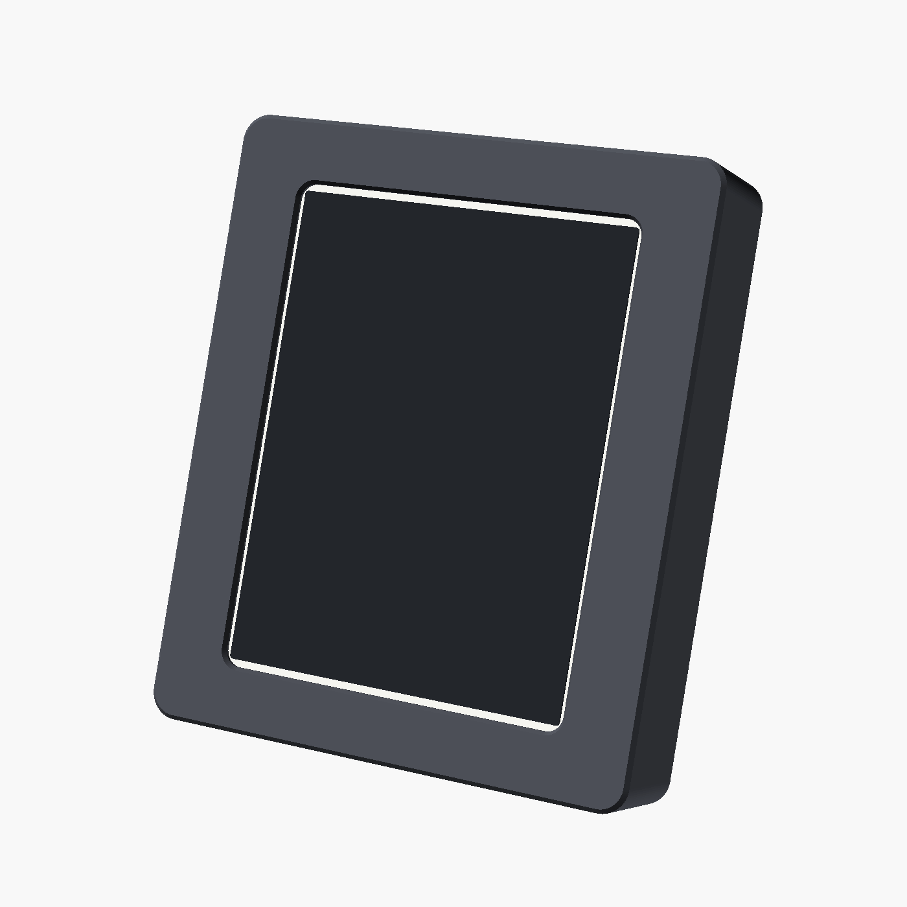 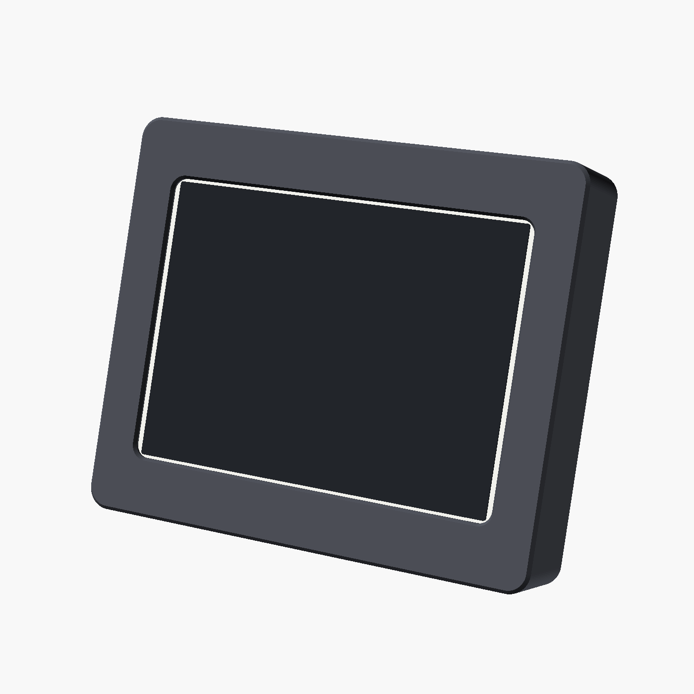


Open [`drawings/index.html`](drawings/index.html) for all eight sheets on one page, and
[TODO.md](TODO.md) for what is still open.

---

## Names

Two dimensions got read as the wrong axis while this was being built, both times because
"width" and "height" swap over when the frame is turned. So: **never width/height for
anything belonging to the display.**

| Axis | Glass | PCB | Model | In portrait (the default) |
|---|---|---|---|---|
| **short axis** | 76 | 78.5 | X | horizontal |
| **long axis** | 90 | 103 | Z | vertical. **The ribbon leaves the glass on a long-axis edge, and runs along the long axis.** |
| **depth** | 1.05 | 1.6 | Y | 0 at the outer front face |

Depth is the axis that points *up* off the print bed, so "taller", "more room on top" and
"height off the glass" in slicer terms all mean **deeper** here.

### The ribbon route

Hold the module with the **e-ink face down**, so you are looking at the rear. The ribbon
leaves the glass on the **long-axis edge** — the one with the 9.4 mm dead border — folds
back behind the glass, then:

1. turns **90° to the left, running along the long axis**, and
2. turns **90° back to the right, away from the long axis**, to reach the 8-pin header.

That middle leg is the whole reason for the shape of the cutout. The relief is a **40 mm
slot running along the long-axis edge**, not a local pocket where the ribbon exits: the
ribbon spends 40 mm travelling *parallel* to that edge before it turns back out. Sheet 4,
balloon 6, is the cutout itself.

The three sizes are deliberately *not* called width/height/depth:

| | Parameter | Now | Meaning |
|---|---|---|---|
| **out** | `rib_clr` | 3.0 | outboard from the pocket edge, along the short axis — the room the fold back on itself needs |
| **deep** | `rib_dep` | 3.0 | past the glass back face, along depth — so the fold has somewhere to go |
| **long** | `rib_w` | 40.0 | along the pocket edge, on the long axis — the run described above. `rib_off` pins one end, so raising this extends the slot in one direction only; it does not recentre |

The three long-axis numbers close exactly: **15 from one glass end, 40 of slot, 35 from the
other — 15 + 40 + 35 = 90** against a 90 mm glass, with `rib_far` reporting 35 rather than
absorbing an error. `rib_off = 15` is measured from the model's −Z glass edge. Which
physical end of the module that is depends on which edge the 8-pin header sits on, and
that is still to be confirmed — see [TODO.md](TODO.md).

### The three nested recesses

Front to back. Not interchangeable, and each has its own clearances:

| Name | What it holds | Size | Parameters |
|---|---|---|---|
| **window** | nothing — it's the through-opening the ink is seen through | 65.0 × 87.4 | `win_*` |
| **glass pocket** | the glass, in a shallow step | 77.5 × 91.5 × 1.26 | `pan_*` |
| **PCB cavity** | the module PCB, behind the glass | 79.5 × 104 | `cav_*` |

### Vocabulary

- **bezel** — the visible plastic between the window edge and the outer edge (13.45 on the
  short-axis sides, 10.5 on the long-axis ends). Never the pocket. Also not a *bevel* — a
  bevel is an angled edge, which here is a **chamfer** (`front_chf`, `win_chf`, `rear_chf`).
- **clearance** / **margin** — the gap between a part and the recess holding it. Always
  quoted as the **total across an axis**, not per side: "margin 1.5 on the short axis" is
  0.75 a side.
- **relief** — material taken away at a **corner**, so a sharp-cornered part can seat in a
  printed corner that carries a nozzle fillet. Always centred *on* the corner; that is the
  function, so it cannot be moved inboard. One is fitted: **pocket relief** (`pan_rel` =
  1.4, at the glass pocket corners).
- **ribbon relief** — the slot described above.
- **white show** — `white_show_short` / `white_show_long`, the strip of the panel's own white
  border left visible inside the window on purpose. **One per axis** (0.7 short, 1.3 long),
  because the window is specified on the short axis and one shared value cannot do both.
- **parts** — **frame** (front shell), **cover** (back), **disc** (rotating puck), **leg**
  (kickstand), and the **bezel test tile** (front-face-only print for checking fit).
- **tape pad** — `tape_*`, a shallow recess in the **ledge behind the glass** where tape holds
  the glass down from the rear. Two of them, one at each long-axis end. Not visible from the
  front.

### The glass is taped from behind, not press-fitted

A printed 91.0 pocket measured short on the long axis, so the pocket is **77.5 × 91.5** —
1.5 mm of total margin on *both* axes, sized for print variance rather than for a press fit.
Loose enough to rattle, so the glass is taped: tape runs across the glass **back** face, over
the pocket edge, and onto the ledge at `pcb_face_y`.

That ledge — the step between the glass pocket and the larger PCB cavity — is the only frame
surface behind the glass, and it is the reason the pads go where they do:

| Edge | Ledge width | Usable |
|---|---|---|
| each long-axis end | **6.25 mm** | yes |
| short-axis sides | 1.00 mm | no — too narrow to stick to |

So two pads, one at each long-axis end, each **40 mm along the short axis × 5 mm into the
ledge × 0.3 mm deep**, starting at the pocket edge so tape runs off the glass without a step
to climb. Pad face lands at depth 2.35 against a glass back face at 2.45, so the tape dips
0.1 mm rather than standing proud.

**They are recessed because the PCB front face lands on that same ledge** (depth 2.65). Tape
lying on top of it would push the whole module back by its own thickness. Recessed, tape
thickness stops mattering.

The cost is PCB seat: 5 mm of the 6.25 mm ledge is recessed over 40 mm of the 79.5 mm width,
leaving 1.25 mm of full-height seat at each end plus the full ledge outboard of that 40 mm,
and the 1.00 mm short-axis ledges untouched down both full sides. `frame_module` is clear.
`tape_pad = false` removes them.

---

## Power

One cell, one charger, one conversion. USB-C in at the back face, the charger's power-path
output straight to the driver board's 5V pin, which Waveshare specify as a **3.6–5.5 V
input** — a 1S cell drives it directly.

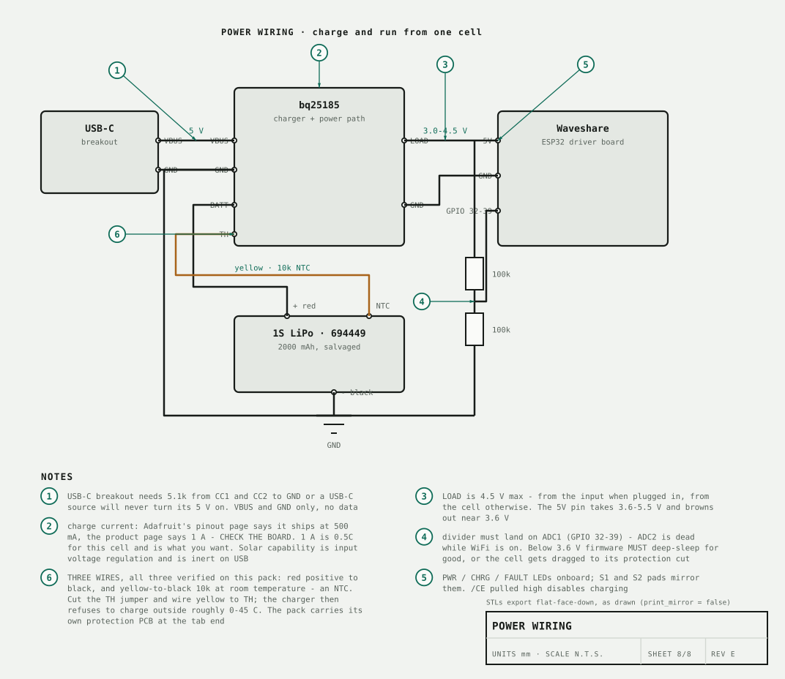

- **Adafruit bq25185** (#6091, $6.95): USB-C in, JST battery, JST load out regulated to
  ≤4.5 V, real power path so the board runs from USB while the cell charges instead of
  cycling it. Charge current is a solder jumper — **set 1 A**, which is 0.5C for this cell.
  Adafruit's own two pages disagree on what it ships at (product page says 1 A, the pinout
  guide says 500 mA), so check the board.
- The board's 5V pin is an input only: no charge circuit, no battery connector, no charge
  LED. Running from a cell and refilling that cell are two separate jobs, which is why the
  charger is in the build.
- **Charge port is on the back face**, not the charger's own USB-C. A small USB-C breakout
  with the 5.1 kΩ CC pulldowns stands in printed guide rails behind the cover with its
  receptacle flush in the back face; two wires run from it to the charger's **VBUS** and
  **GND** pads. Charge only, no data — which is all this needs.
- **Battery divider:** two 100 kΩ from the cell to an ADC pin on **ADC1 (GPIO 32–39)** —
  ADC2 is unusable while WiFi is on. Firmware reads it on every wake and, below ~3.6 V,
  calls `esp_deep_sleep_start()` with no timer and stays there. The board browns out at
  3.6 V on its own, but a brownout loop drags the cell down to its protection cut, and deep
  discharge is what kills LiPo cells.

### One opening in the whole assembly

`flash_port = false`, so the **charge port in the back plate is the only hole in the
finished case.** The driver board's own USB-C — which is for *flashing*, not power — sits
behind a **blind** pocket in the long-axis top end, so the jack has somewhere to sit (it
stands 0.2 mm past the cavity wall, so the pocket is not optional), leaving 1.5 mm of skin.
`frame_board` is clear.

⚠ **Flash the ESP32 before final assembly**, and leave OTA working. With the port closed
there is no wired access to the driver board once the cover is on. Set `flash_port = true`
to cut the opening back through.

### Runtime

The driver board sets it: Waveshare rate it at `<2 mA` idle, and only with **DIP switch 2
off** so the CP2102 is unpowered — left on, a reviewer measured 10–13 mA in "deep sleep".
So: **switch 2 on to program, off to run.**

At 2 mA and ~49 mAh/day, against the 3.6 V floor (which leaves about 85% of the cell's
2000 mAh usable), runtime is **roughly five weeks** — about 35 days on battery, ~41 days
standby, ~33 days with an hourly refresh. About 95% of that budget is the board sitting
idle; a few refreshes a day cost barely 1 mAh between them. Refresh as often as you like,
it is not what empties the cell.

`<2 mA` is a spec, not this board — put a meter in series with the battery lead and read
the real number. If there is a power LED, cutting it is often worth 1–2 mA on its own.

### The cell

A salvaged 1S pouch, **2000 mAh, 694449, 44 × 49 × 6.9 mm**, three wires, all three
checked on this pack:

| Wire | Is | Goes to |
|---|---|---|
| red | **positive** (verified against black) | JST B+ |
| black | **negative** | JST B− |
| yellow | the other leg of a **10 kΩ NTC** (measured yellow→black at room temperature; its common leg is tied to black) | the charger's **TH** pad |

So the thermistor gets used: **cut the TH jumper** on the #6091 (it ships jumpered, which
disables the function) and wire yellow to the pad. The charger then refuses to charge
outside roughly 0–45 °C instead of trusting a salvaged pouch to behave.

The pack also carries **its own protection PCB** under the tape at the tab end, so it has
overcurrent, overdischarge and short protection independent of the charger.

## Buttons

Not fitted, but the frame is ready. The display uses **GPIO 13 (CLK), 14 (DIN), 15 (CS),
25 (BUSY), 26 (RST), 27 (DC)**; everything else on the headers is yours. For buttons that
also wake the ESP32 from deep sleep you need RTC-capable pins — **GPIO 32/33 are the
cleanest** if the headers bring them out, otherwise **GPIO 4**. Keep off 0, 2, 12 and 15:
they are strapping pins, and a button held at reset changes boot behaviour.

To add them later: set `btn_n = 3` in the SCAD file and re-export the frame. That cuts
three Ø4.2 plunger holes in the +X wall (9.4 mm thick, the only wall with real meat in
it), 12 mm apart, for switches mounted on a strip inside. There is no room for front
buttons — the bezel is 10.5 mm and the module's PCB is directly behind it.

---

## What goes where

Cavity is 79.5 × 104 mm, split into two bands across the long axis: the boards share one,
the cell takes the other.

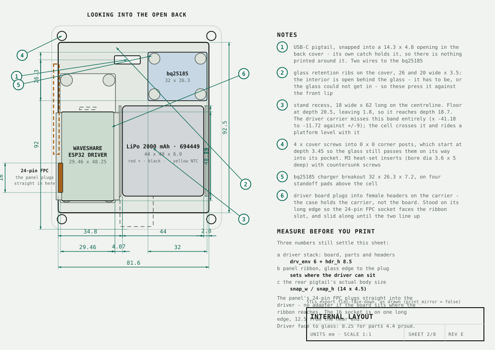

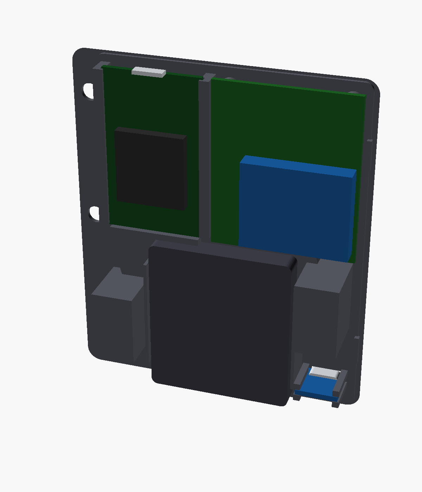 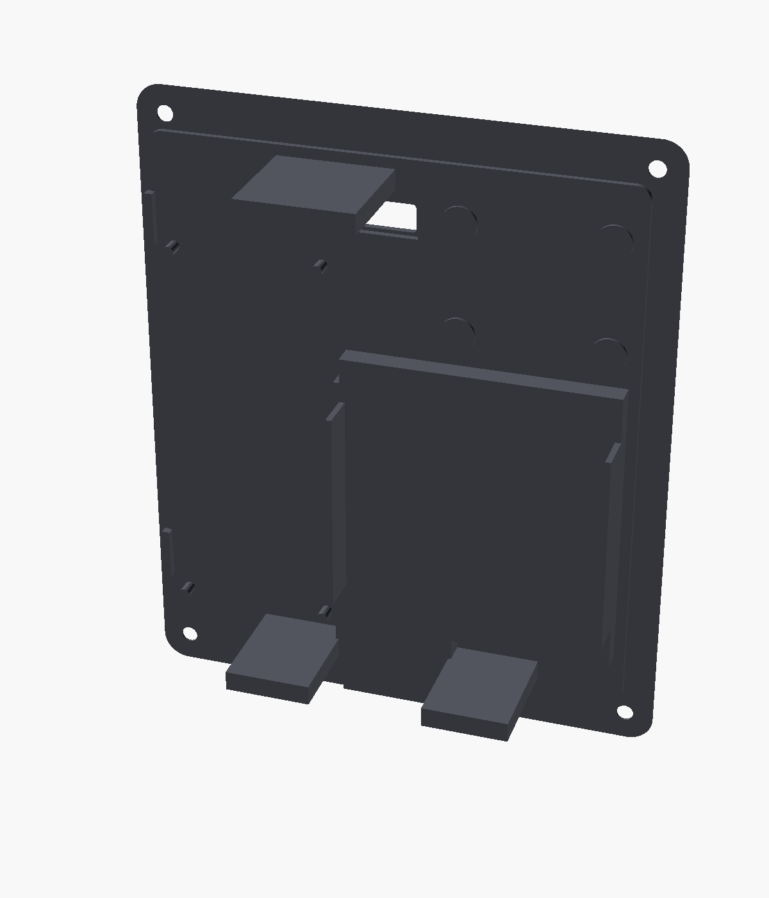

The two boards fit side by side across one band — 43.2 + 2.7 + 29.46 = **75.36 mm in a
79.5 mm cavity** — and the 2000 mAh cell (44 × 49) takes the other. No other split works:
rotate the cell, or put one board beside it, and some board always ends up short of width.
The half-size Perma-Proto doesn't fit at all — at 50.8 mm wide it leaves 28.9 mm beside it,
narrower than any sensible cell, and forces the driver board onto a second layer.

### The ribbon relief sets the frame width

The ribbon slot reaches **1.80 mm further out than the PCB cavity does**, so the frame's
short axis is set by the notch, not by the electronics:

```
SHORT AXIS driven by: THE RIBBON RELIEF  (cavity needs 45.15, ribbon needs 45.95)
OUTER: short axis 91.9 | long axis 108.4 | depth 25
```

The model grows `W` automatically to keep `wall_rib = 1.0` mm of material outboard of the
notch, so it is always valid — but it costs **3.60 mm of width** over what the electronics
need, and put the side bezels at 13.45 mm. The notch sits just outboard of the *pocket*, so
widening `pan_clr_w` pushes it out and the frame grows with it; that is why the 0.75 mm
pocket clearance cost 0.5 mm of overall width.

One measurement gets most of it back: how far the glass sits from the PCB edge on the
ribbon side. The PCB is 78.5 wide and the glass is 76, so there is 2.5 mm to distribute.

| `pan_off_x` | Frame width | Side bezel | Short axis driven by |
|---|---|---|---|
| 0 — glass centred (assumed) | **91.9** | 13.45 | the ribbon relief, needing 45.95 |
| 0.625 | 90.65 | 12.83 | the ribbon relief, needing 45.33 |
| 0.8 | 90.3 | 12.65 | crossover — ribbon and cavity both need 45.15 |
| 1.25 and beyond | **90.3** | 12.65 | the PCB cavity. Nothing past 0.8 buys any width |

So the whole prize is **1.6 mm of width and 0.8 mm of side bezel**, and it is all collected
by the first 0.8 mm. Measure the gap between glass edge and PCB edge on *each* side of the
ribbon axis, set `pan_off_x` to half the difference, and re-export. It is on the
[TODO](TODO.md).

### Depth is the tight axis


The budget is set **over the cell**, not over the boards: **7.9 mm** clear there against
**12.7 mm** over the PCBs. So whichever band the module's 8-pin header lands in has to be
the *board* band — the boards clear a 9 mm mated PH2.0 plug, the cell does not. The model
carries that header as real geometry (`mod_conn()`) and checks it; with the **assumed**
position it reports

```
HEADER vs CELL: needs 9, has 7.9 -> CLASH by 1.1 mm
```

The driver board is tight on the same axis: its envelope is 30 × 50 × **15 mm**, there is
14.8 mm clear over the stand puck (0.2 mm short), and `drv_module` reports 1050 mm³ against
the module PCB — 0.7 mm through the board's whole footprint. Both are open, and both are
in [TODO.md](TODO.md).

### Mounting

- **Perma-Proto** — two M2.5 screw posts on the board's 1.4″ hole spacing plus four
  corner pads.
- **Driver board** — slides down into two printed rails, no holes needed, with a stop at
  the bottom and its USB-C facing the top end.
- **Cell** — drops into a fenced pocket on a flat platform (the platform exists so the
  cell doesn't straddle the step where the stand pocket bulges into the interior).
  Foam tape holds it.
- **Module** — bezel lip in front, two printed pads above and below the cell behind. Foam
  tape on the pads takes up the tolerance stack.

### Ports

| Port | Where | Purpose |
|---|---|---|
| USB-C breakout | **back face**, 25 mm left of centre, 15.5 mm up | Charging and running from the wall. Wired to the charger's VBUS + GND |
| USB-C (Waveshare) | top wall, **blind** | Flashing, before assembly. DIP switch 2 on to program, **off** to run |

The rear port sits below the stand pocket and off the leg's centreline, and the back edge
carries a 2 mm chamfer, so a plug clears the desk with the frame leaning back. A
right-angle cable is tidier but not required.

---

## The kickstand

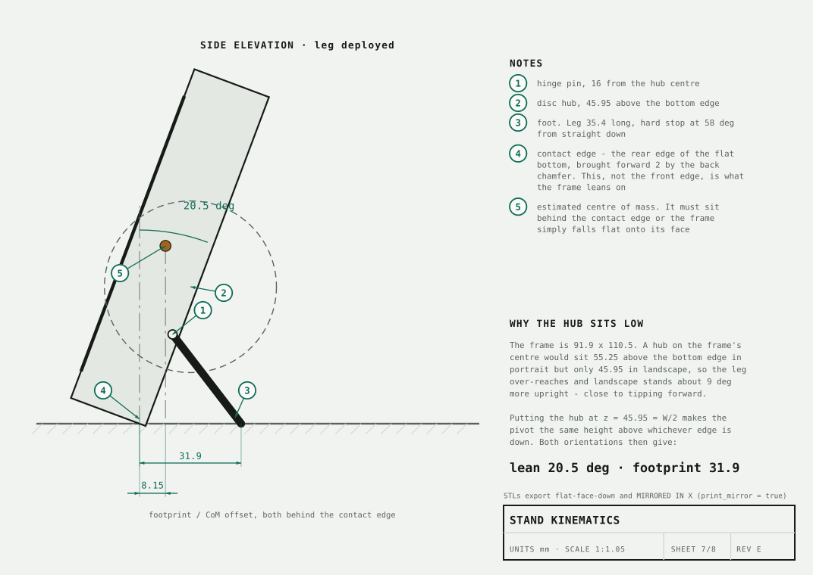

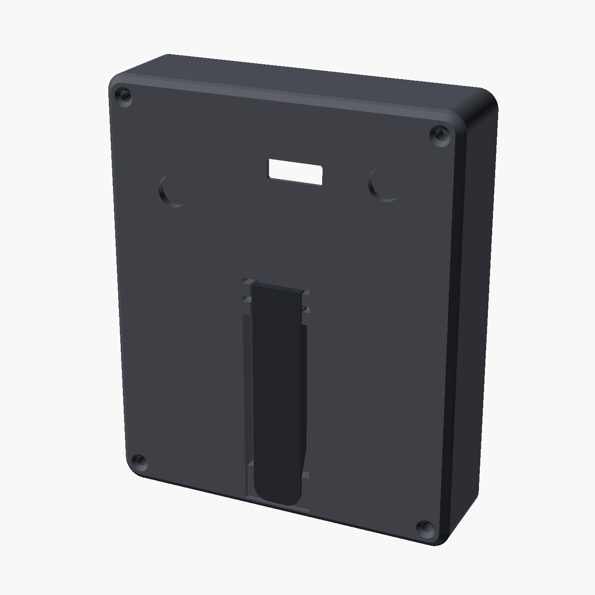 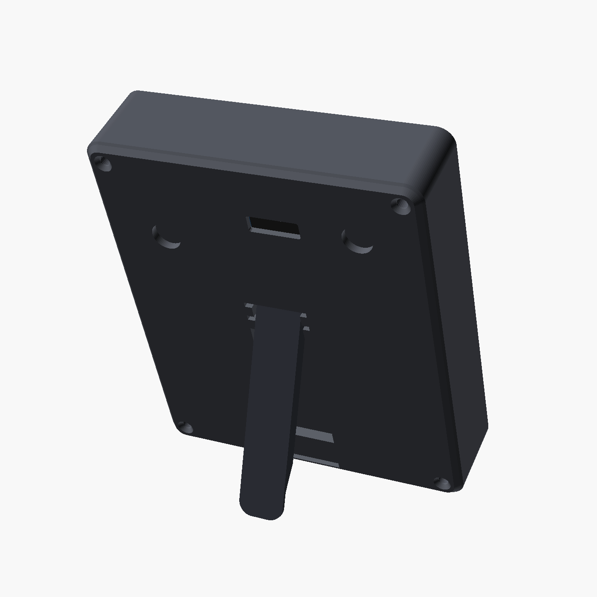 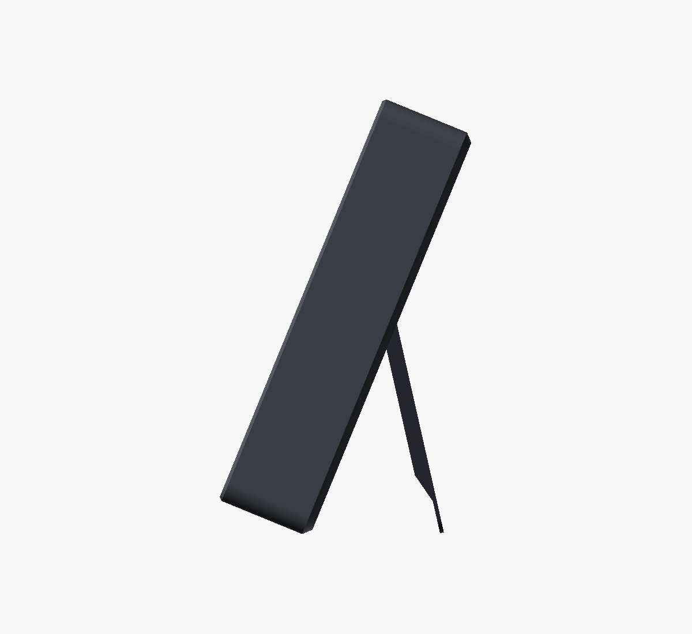

- **Disc** Ø54 × 4 mm — bayonets into the pocket (three lugs, twist ~45°), four radial
  detents at 0/90/180/270°. Turn it to 45° to lift it out.
- **Leg** folds flush into the disc, swings out to a hard stop at 58° where a flat heel
  lands on the pocket floor, so the load goes into the cover skin rather than the hinge.
- **Pin** Ø2 × 43 mm steel rod, or a cut length of 1.75 mm filament. Trapped by the pocket
  wall once the disc is in.

**The hub is deliberately 8.25 mm below the frame's centre**, at exactly half the frame's
*width* above the bottom edge. Rotate the frame 90° and the pivot ends up the same distance
above whichever edge is now the bottom — so portrait and landscape get an identical stance
(**20.5°, 31.9 mm footprint**) instead of the ~9° difference a centred hub forces.

The frame rests on the **rear** edge of its flat bottom — a slab leaning backwards contacts
at the back of its base. The 2 mm rear chamfer moves that contact edge forward, and with the
equal-stance hub the centre of mass sits 9 mm (portrait) and 6 mm (landscape) behind it.

A single hard stop, not a ratchet: the hinge axis lies *in* a 4 mm disc, so the knuckle
can't exceed ~3 mm, which puts 15° teeth at 0.4 mm — under what a 0.4 mm nozzle resolves.
The load also wants the leg to *open*, at ~30 N·mm about the hinge, which no printed detent
that size holds.

---

## Parts and printing


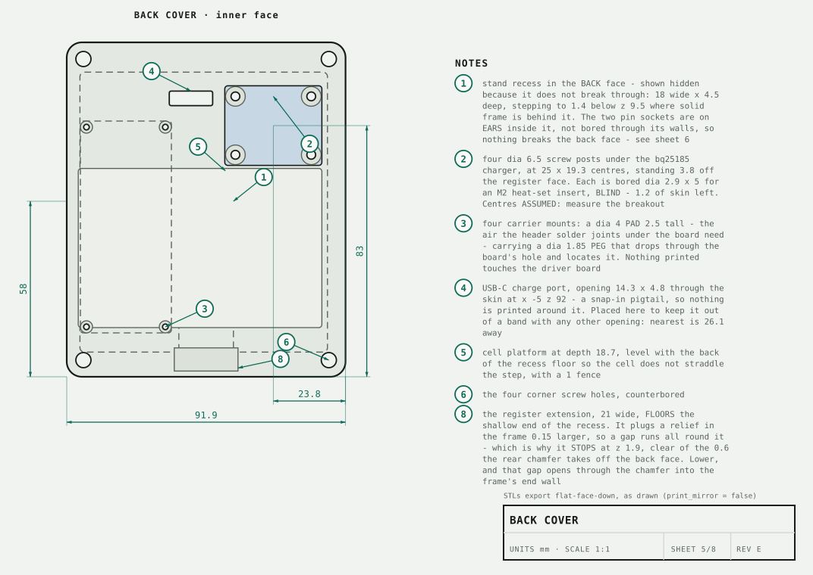

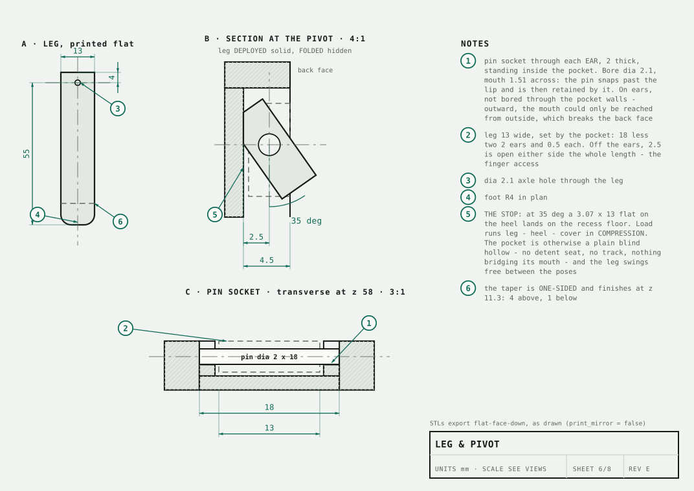

The STLs export ready to slice — **no rotating in Orca, no supports**. This is the four
printed parts exactly as the exporter leaves them, which is how they land on the bed:

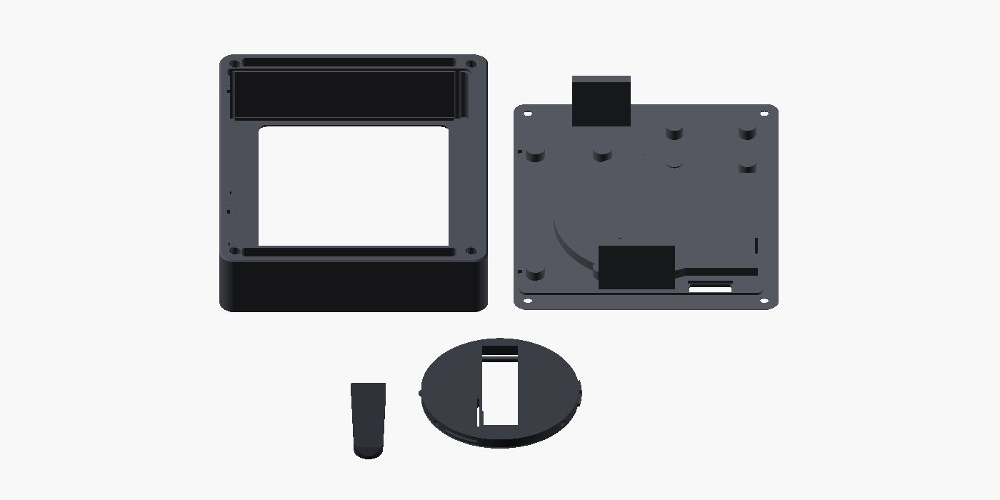


| Part | STL | On the bed | Why | Filament |
|---|---|---|---|---|
| Frame | `stl/frame.stl` | front face down | 3835 mm² of first layer, and the cavity opens upward. The other way up, the 1.4 mm front plate has to bridge the whole 79.5 × 104 cavity | ~54 g |
| Back cover | `stl/cover.stl` | outer back face down | 6802 mm² of first layer, posts and rails build upward | ~47 g |
| Disc | `stl/disc.stl` | outer face down | symmetric | ~8 g |
| Leg | `stl/leg.stl` | flat | symmetric | ~2 g |
| Bezel test tile | `stl/bezel_test.stl` | front face down — **print this first** | same as the frame | ~20 g |

PLA or PETG, 0.2 mm layers, 4 perimeters, 15–20% infill. The bayonet groove and window
chamfer are both cut at 45°, the only bridge is the 1.9 mm ceiling over the closed flash
pocket, and only the 0.8 mm front chamfer overhangs — at 45°, on the first layer. Put the
visible face on the bed; that surface finish is most of the look.

### ⚠ The STLs are mirrored in X

`print_mirror = true` mirrors all five parts at export. They still mate with each other, but
the assembly is the **opposite hand** to the drawings: the ribbon relief, the screw spine
and the charge port are on the other side. On the bed the ribbon relief sits at
**x ≈ +45.95** (right of centre); un-mirrored it sits at −45.95.

**The drawing sheets show the as-designed hand; the renders show the printed hand.** The
renders import the STLs and assemble them exactly as they come out of the exporter, so
they are the object you will hold — which reads left-right reversed against every sheet.
`renders/11-print-plate.png` is the rawest of them: the four STLs untouched, in the
orientation the slicer will open them in.

Set `print_mirror = false` to go back to the drawn hand — the renders and the note in
every title block follow the flag, and the sheets themselves are always drawn as designed.
The interference checks run on un-mirrored geometry and are unaffected either way.

### Hardware

- 3 × M2.5 × 8 mm self-tapping screws (cover)
- 2 × M2.5 × 6 mm (Perma-Proto)
- Ø2 × 43 mm rod or filament offcut (kickstand pin)
- Adafruit **bq25185 (#6091)**; 1S LiPo **2000 mAh, 694449, 44 × 49 × 6.9 mm** (the
  salvaged cell above)
- USB-C breakout board with 5.1 kΩ CC pulldowns, ~13 × 13 mm
- JST-PH pigtails, foam tape

---

## Verification

**Print `bezel_test.stl` first.** It is an `intersection()` of the actual `frame()` with a
box — the front 6.85 mm of the full 91.9 × 108.4 face — so it cannot drift from the part it
stands in for. ~40 minutes, ~20 g. It shows all four glass-pocket corners with their relief,
all four cavity corners, all four bezels, the complete window lip and chamfer, and the full
ribbon slot, and you can drop the real module into it. Its depth tracks the ribbon relief
(`rib_y1 + 1.4`) rather than being a round number, because a fixed 5.65 left a 0.2 mm
membrane across the relief floor — a slot that printed closed. `bt_h = 34` gives the old
bottom-band tile if you only want the corners.

**Geometry checks that pass now:**

| Check | State |
|---|---|
| Bodies per part | 1 each, all five |
| Watertight | yes, all five |
| `frame_module` at `cav_rel = 0`, `cav_r = 1.5`, `pan_rel = 1.4` | clear, 0.086 mm to spare on the sharp PCB corner |
| Interference set (14) | 10 empty, 2 zero-volume (coincident faces), **2 real** |

The two zero-volume results are `frame_cover` (the frame's rear face and the cover's front
face are both at `y = body_d`) and `cover_board` (the board sits exactly on its standoffs);
`intersection()` returns coincident faces as zero-thickness sheets, so measure volume, not
emptiness. The other trap: when an intersection *is* empty, OpenSCAD writes no file at all,
so a script that reuses output paths silently re-reads the previous check's result — delete
the output before every run.

The two real ones both live on the depth axis, and both are open — see [TODO.md](TODO.md):

| Check | Volume | What it is |
|---|---|---|
| `conn_cell` | 154 mm³ | the module's mated 8-pin header against the cell, 1.1 mm too deep |
| `drv_module` | 1050 mm³ | the driver board's 15 mm envelope against the module PCB — 0.7 mm through the board's whole 30 × 50 footprint |

`mock_module()` draws the PCB and the glass as **sharp-cornered squares**, matching the real
parts, which is what makes `frame_module` able to catch a corner-fillet problem at all. The
cavity corner radius carries the condition `cav_r ≤ 0.5·√2/(√2−1) = 1.707`; at `cav_r = 1.5`
a sharp PCB corner sits 0.086 mm inside the arc, so **no cavity relief is needed** and the
wall at a cavity corner is 2.2 mm instead of 1.0.

### Thin, but deliberate: the −X wall

Because the ribbon relief sets `W`, everything on the −X edge is tight, and the features
there are cavity-referenced:

| | Wall left |
|---|---|
| outboard of the ribbon relief | 1.00 mm |
| outboard of the register slot | 1.50 mm |
| −X wall generally | 3.00 mm |

All printable at a 0.4 mm nozzle. The register slot is the one to watch if `W` ever comes
down further — it thins 1:1 with the outer face.

The screw spine is referenced to the **chamfered** back face, not to `W/2`:
`scr_x = (cavity edge + (W/2 − rear_chf))/2`, which centres it in the material actually
there — 1.00 mm to the cavity and 1.00 mm to the back-face edge, self-correcting at any
width. Referenced to `W/2`, the counterbore edge lands tangent to the chamfer at
`W = 91.9`, leaving 0.05 mm of material and breaking out onto the back face.

### One known cosmetic defect

The cover exports with **10 non-manifold edges** — edges used by four facets instead of two,
where two surface patches meet along a line. They are not holes: CGAL rates the result
`Simple: yes / Volumes: 2`, the solid is closed, and slicers take it. They sit in the
`rear_chamfer()` hull region at the outer back face (a 0.04 mm sliver at y 24.96–25.00, plus
one at y 22.05–22.25), and they are **not** parameter-dependent. The frame uses the same
chamfer code and is clean, so it is the interaction with the cover's rear-face features.
Left alone deliberately — `rear_chamfer()` is delicate code, and a cosmetically nicer mesh
is not worth reopening it.

---

## Exporting and tuning

```bash
openscad -o stl/frame.stl      -D 'part="frame"'      src/epaper_stand.scad
openscad -o stl/cover.stl      -D 'part="cover"'      src/epaper_stand.scad
openscad -o stl/disc.stl       -D 'part="disc"'       src/epaper_stand.scad
openscad -o stl/leg.stl        -D 'part="leg"'        src/epaper_stand.scad
openscad -o stl/bezel_test.stl -D 'part="bezel_test"' src/epaper_stand.scad
```

Regenerate the drawings from the model after any parameter change:

```bash
openscad -o /tmp/p.stl -D 'part="params"' src/epaper_stand.scad 2>&1 \
  | sed -n 's/^ECHO: "P|\(.*\)"$/\1/p' | tr '|' '=' > /tmp/params.txt
python3 tools/mkdrawings.py     # drawings/sheet*.svg + _sheets.json
python3 tools/mkpage.py         # drawings/index.html
```

And the renders, which import the STLs rather than the model — re-export the STLs first,
or the pictures will show the previous revision:

```bash
sh tools/mkrenders.sh           # renders/*.png, all of it from stl/
```

| Want | Change |
|---|---|
| Keep the stock PH2.0 cable over the cell | `depth = 26.6` |
| Header turns out to be on the other Z edge | swap the `bat_cz` / `proto_z1` / `drv_z1` bands, and move `flash` to the other wall |
| Bigger cell | `bat_w` / `bat_h` / `bat_t` — the band is 79.5 wide × ~51 tall |
| Three side buttons | `btn_n = 3`, then `btn_d` / `btn_sp` |
| More/less white line | `white_show_short` / `white_show_long` |
| Different lean | `stop_ang`, or `pivot_r` |
| Rear port position | `ucb_x` / `ucb_z`; `port_w` / `port_h` for the opening |
| Deeper/shallower back bevel | `rear_chf` — 2.0 is the ceiling before it eats the 2.2 mm walls |
| Looser/tighter disc | `pocket_c` |
| Open the flash port again | `flash_port = true` |
| Print the drawing hand instead of the mirrored one | `print_mirror = false` |

Preview modes: `standing_p`, `standing_l`, `folded`, `guts` (cover populated with mock
electronics), `assembly`, `plate`.

Interference checks are built in — `chk` = `frame_cover`, `frame_module`, `cover_module`,
`cover_board`, `frame_board`, `drv_module`, `conn_cell`, `conn_board`, `conn_cover`,
`cover_disc`, `disc_legf`, `disc_legd`, `cover_legd`, `cover_legf`:

```bash
openscad -o /tmp/chk.stl -D 'part="none"' -D 'chk="cover_board"' src/epaper_stand.scad
```

## Sources

- [4.2inch e-Paper Module (B) manual — 91 × 77 × 1.05 mm panel, 84.8 × 63.6 active](https://www.waveshare.com/wiki/4.2inch_e-Paper_Module_(B)_Manual)
- [e-Paper ESP32 Driver Board pinout and "5V pin supports 3.6V to 5.5V… can be powered by a lithium battery"](https://spotpear.com/index/study/detail/id/375.html)
- [e-Paper ESP32 Driver Board product page — `<2mA` low-power current with the CP2102 unpowered](https://www.waveshare.com/e-paper-esp32-driver-board.htm)
- [Fasani — measured 10–13 mA "deep sleep" on this board](https://fasani.de/2020/04/19/waveshare-eink-esp32-driver-board/)
- [Adafruit bq25185 charger, #6091](https://www.adafruit.com/product/6091) · [pinouts](https://learn.adafruit.com/adafruit-bq25185-usb-dc-solar-lithium-ion-polymer-charger/pinouts) · [TI BQ25185](https://www.ti.com/product/BQ25185)
- [Perma-Proto quarter-size — 1.7″ × 2.0″, holes 1.4″ apart](https://www.pololu.com/product/2765)
</content>
