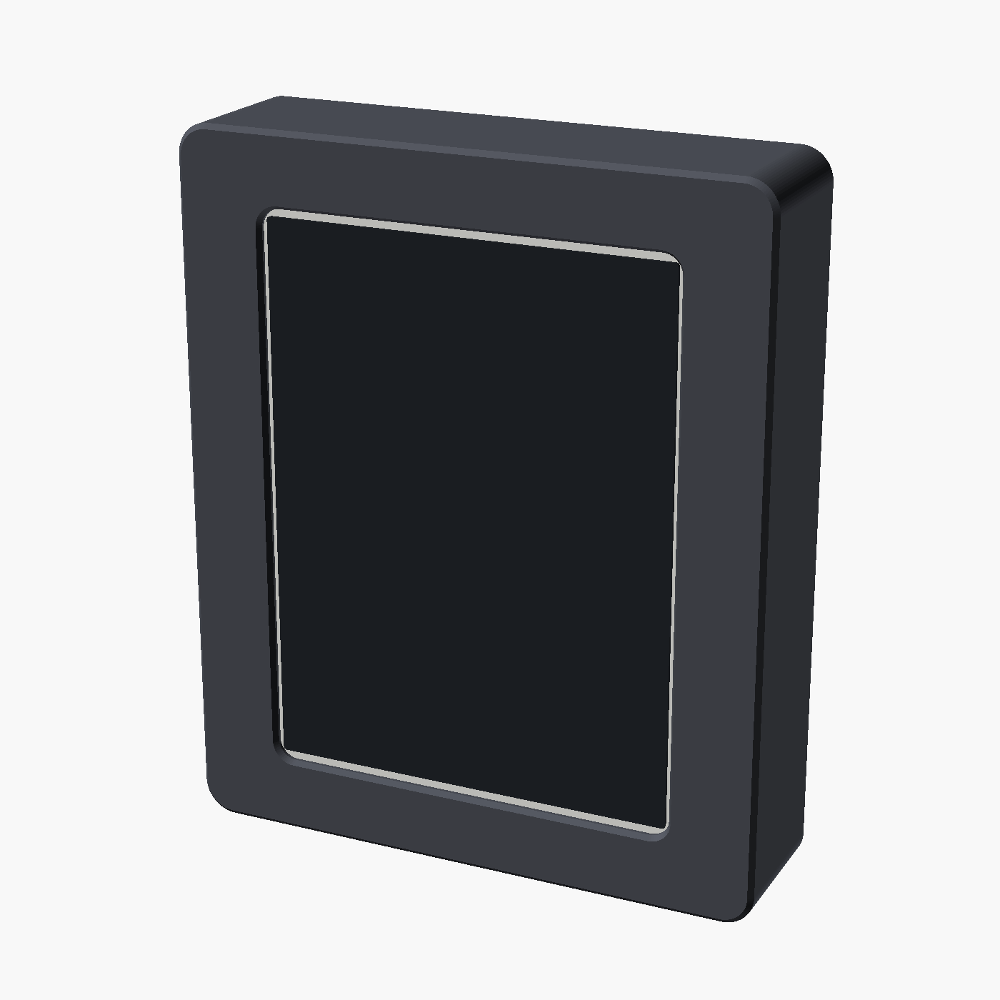

# 4.2" e-Paper desk frame — minimal bezel, snap-out kickstand, battery inside

A slim desk frame for the **Waveshare 4.2inch e-Paper panel (B)** driven by the
**Waveshare e-Paper ESP32 Driver Board (Rev 3)**, with a LiPo and a power-path charger
inside, and a single kickstand leg on the back that folds flush and swings out onto a
positive mechanical stop. Portrait.

The panel is **bare glass and an FPC tail** — no PCB behind it. The tail leaves the centre of
the **RIGHT** side and makes a shallow S, out and up towards the **TOP**, before turning
inboard. It reaches the driver board's socket — but it has no slack, so it cannot survive the
cover being lifted off. A **Waveshare FPC adapter** is fitted as a service loop.

One parametric OpenSCAD file: `src/epaper_stand.scad`. Every dimension quoted here comes
out of it, and so does every drawing — `tools/mkdrawings.py` reads the model's own
parameter dump, so the sheets cannot drift from the STLs. **The renders are built from
`stl/*.stl` itself** (`tools/mkrenders.sh`), so what the pictures show is what the slicer
gets.

| | |
|---|---|
| Outer | 91.9 × 110.5 × 25.0 mm |
| Bezel | 13.45 mm short-axis sides, 11.55 mm long-axis ends |
| Panel white showing | 0.7 mm short axis, 1.3 mm long axis |
| Lean | 22.3°, 34.1 mm footprint |
| Interior | 81.6 × 92.5 × 21.0 mm, with 9 mm end walls |
| Fasteners | 4 × M2.5 countersunk into heat-set inserts, one near each corner |
| Print | 3 parts, ~112 g of filament; supports on the leg only |

 


Open [`drawings/index.html`](drawings/index.html) for all eight sheets on one page,
[TODO.md](TODO.md) for what is still open, and [`fusion/README.md`](fusion/README.md) to
pick the model up in Autodesk Fusion.

---

## Names

Two dimensions got read as the wrong axis while this was being built, both times because
"width" and "height" swap over when the frame is turned. So: **never width/height for
anything belonging to the display.**

| Axis | Glass | Interior | Model | In portrait (the default) |
|---|---|---|---|---|
| **short axis** | 76 | 82.1 | X | horizontal |
| **long axis** | 90 | 80.9 | Z | vertical. **The ribbon leaves the glass on a long-axis edge, and runs along the long axis.** |
| **depth** | 1.05 | 21.0 | Y | 0 at the outer front face |

Depth is the axis that points *up* off the print bed, so "taller", "more room on top" and
"height off the glass" in slicer terms all mean **deeper** here.

### The four sides have names

Width/height are banned because they swap when the frame turns. So do "top" and "bottom"
unless you say which way up — so the datum is fixed once, here, and everything uses it:

**Hold the panel with the front face down, in portrait.** You are looking at the **rear
face**. Put 0,0 at the top-left, X increasing across, Y increasing down. Then:

| Side | Which edge | Length | Runs along |
|---|---|---|---|
| **TOP** | Y = 0, X sweeping across | 76 (glass) | the short axis |
| **BOTTOM** | Y = max, X sweeping across | 76 | the short axis |
| **LEFT** | X = 0, Y sweeping down | 90 | the long axis |
| **RIGHT** | X = max, Y sweeping down | 90 | the long axis — **the tail leaves this side** |

And the two faces are **front face** (the ink you look at) and **rear face** (the back, facing
you during assembly). Never "top face" for either.

### How those map into the model

The model does not use the build frame and is not going to be renamed, so here is the
mapping. It is worth reading once, because two separate bugs came out of getting it wrong:

| Build frame (front face down, 0,0 top-left) | Model |
|---|---|
| **TOP** | `+Z` end — `Z = 100.25` at the glass |
| **BOTTOM** | `−Z` end — `Z = 10.25` at the glass. **The kickstand folds down towards here**, foot tip at `Z = 3` |
| **LEFT** | `+X` side |
| **RIGHT** | `−X` side — the ribbon relief reaches `x = −44.95` |
| **front face** | `Y = 0` |
| **rear face** | `Y = 25` |
| X increasing (left → right) | `−X` direction |
| Y increasing (top → bottom) | `−Z` direction |

Two sign flips to keep hold of:

- **Build-Y and model-Z run opposite ways.** "18 mm down from the top" is `Z = 100.25 − 18`,
  not `Z = 18`.
- **Build-X and model-X also run opposite ways**, because looking at the *rear* face reverses
  the short axis. Derive it if you doubt it: looking along `−Y` with `+Z` up gives a view-right
  of `cross((0,−1,0),(0,0,1)) = (−1,0,0)`. That is why RIGHT is `−X`, and why the relief being
  at `x = −44.95` is correct rather than mirrored.

What fixes `−Z` as the BOTTOM, independently, is the kickstand: it pivots at `Z = 58` and its
foot folds *down* to `Z = 3`, and a stand's foot is at the bottom.

### The ribbon route

Front face down, portrait, so you are looking at the **rear face**. The tail leaves the
**CENTRE of the RIGHT side** — not an end — and makes a shallow S:

| Leg | Direction | Size | Parameter |
|---|---|---|---|
| 1 | straight out from the glass edge | 4 mm | `rib_out` |
| 2 | 90° turn towards the **TOP**, running parallel to the RIGHT edge | 9 mm wide × 20 mm long | `rib_band`, `rib_run` |
| 3 | 90° turn **away from the RIGHT side** — inboard, across the rear face | 10 mm | `rib_leg3` |

Leg 2 is the whole reason the relief is a slot rather than a local pocket at the exit: the
ribbon spends 20 mm travelling *parallel* to the RIGHT edge before it turns inboard. Leg 2 is
9 mm wide but only reaches 4 mm outboard of the glass — the other 5 mm of its width lies
*behind* the glass, which is open interior, so the frame only has to clear 4 mm.

The three relief sizes are deliberately *not* called width/height/depth:

| | Parameter | Now | Meaning |
|---|---|---|---|
| **out** | `rib_clr` | 3.0 | outboard from the pocket edge, along the short axis |
| **deep** | `rib_dep` | 3.0 | past the glass back face, along depth — so the fold has somewhere to go |
| **long** | `rib_w` | 49.0 | along the RIGHT edge, on the long axis |

**`rib_w` and `rib_off` are derived from the route now, not typed in.** `rib_w` is
`rib_run + rib_band + 2 × rib_marg` and `rib_off` puts the slot's near edge half a band below
the exit, so the slot straddles the exit and covers the run to the TOP. They come out at 33
long, **30.5 up from the BOTTOM, 10.5 short of the TOP** — and they cannot drift from the
route any more, which is how they went wrong twice:

- `rib_off = 15` put the slot at the **BOTTOM**, under a source comment insisting the model's
  −Z was the top and warning against "fixing" it. It was the reversed reading it warned about.
- `rib_off = 35` then put the slot 15 short of the **TOP**, from reading "the ribbon is towards
  the top" as the exit position. The exit is at the **centre**; it is the *run* that goes
  towards the top. It is 30.5 now, and derived rather than typed.

**One clearance is 0.25 mm short.** Leg 1 needs 4 mm out from the glass edge; the relief gives
3.75 (`rib_clr` 3.0 from the pocket edge, plus 0.75 of pocket clearance). `rib_clr = 3.25`
would fix it and grows the frame 0.5 mm on the short axis. The stand no longer rides on the
frame's width, so the stance does not move with it, but the frame does. The echo prints the
shortfall on every run.

### The tail reaches the driver — but it cannot cross the split

The driver board faces **down**, so its socket edge is the one nearest the display, and the
tail can meet it. Leg 3 runs **10 mm** inboard, ending between x −35.2 and −26.2.

Which way round the board is mounted decides whether it fits:

| Socket 12.5 mm from… | Board spans | |
|---|---|---|
| the **BOTTOM** end | z 62.75 … 111.0 | overruns the interior top by 9.5 mm |
| the **TOP** end — hangs downward from the socket | z 39.5 … 87.75 | **fits** (`fpc_end = "top"`) |

So a direct plug-in works geometrically. **The reason it still is not enough is service.**

The glass is on the **frame**. The driver is on the **cover**. Anything joining them crosses
the split, and the panel's tail cannot:

| | |
|---|---|
| Tail length | 18 mm, with no slack designed in |
| What its 180° fold gives back when it straightens | (π−2) × `rib_dep` = **3.4 mm** |
| Lift needed to get a fingernail on a ZIF lever | ~25 mm |
| Shortfall | **21.6 mm** |

Lift the cover and you are pulling on the glass. So the **adapter is a service loop, not a
reach fix**: the short tail plugs into it on the panel side, and a longer FPC crosses the
split with enough slack to open the case.

### Where the service loop goes

Two placements were costed and both fail, which is worth recording because the answer is
neither of them:

- **In front of the driver.** Stacks 5 mm onto 16 against the 17.45 mm the driver column has —
  3.55 short, and the driver's own USB-C shell and WROOM module already take most of what is
  left there. It would cost `depth` 25 → 28.55, or low-profile headers (`hdr_h` 8.5 → 5.5 buys
  back 3.0).
- **On the carrier board.** Driver 48.25 + adapter 32 = 80.25 against 70, and overhanging fails
  too because the adapter's corner holes are 28 apart, so the far pair lands off the board.

Mounting the driver on the **frame** instead, so nothing crosses the split at all, does not
work either: the glass drops in through the interior and needs the full 90 mm clear, so
anything standing off the frame's ledge blocks it — the same reason there are no corner posts.

**The adapter is taped to the back of the glass.** That is what makes it fit, and it is also
the right side of the split — taped to the glass it stays with the **frame**, so the panel's
short stiff tail never crosses the joint and only the long FPC does.

| | |
|---|---|
| Outline | 18 × 32 × **5 mm** (depth with both connectors, confirmed) |
| Where | against the glass's back face, x −40.45 … −22.45, z 65.75 … 97.75 |
| Depth there | glass back 2.65 to the carrier's face 18.5 = **15.85 mm**, so it clears by 10.85 |
| Clear of the driver's parts by | 2.0 mm (`adapt_gap`; 1.0 still caught them by 0.2) |
| Leg 3 | turns at z 75.25 and runs **10 mm** inboard, ending between x −35.2 and −26.2 — **lands on the adapter** |
| Holding force | 18 × 32 = 5.8 cm² of foam tape ≈ 46 N in shear against a 0.02 N part |

It overlaps the carrier by 18.75 mm **in plan view**, and that is not a clash — they are 10.85 mm
apart in depth. Reading that plan-view overlap as a conflict is what made the adapter look
homeless for so long, and it was never real.

Two things moved to make room, both small: the **top glass-retention rib** shifted toward +X
(`pad_off1` 12.0 → 7.8, so it spans x −21.0 … −1.0 instead of −25.2 … −5.2, still well inside
the glass's dead border), and the adapter sits 2 mm above the driver's tall parts.

The one real risk is **peel, not shear**: a 24-pin FPC pushing perpendicular can lift a corner.
Route the tail so its spring-back loads the tape in shear, and use foam rather than a thin
film so it can absorb the bend.

**Oversize is free here.** The hollow is only ever a problem when it is too *small*, so
`rib_marg` is set generously (10) rather than to the route. The hollow is **49 mm** — 14.5 mm
below the exit and 34.5 above — which covers leg 2 running anywhere from nothing to 34 mm, and
so covers both the 18 mm and the 24 mm readings of the tail length. That takes the
disagreement between them off the critical path.

**What caps its length is the corner screws, not the route.** The inserts at z 14.5 and 96
reach x −38.65, which overlaps the hollow's x −44.95 … −41.95 by 3.3 mm — so the hollow has to
stop short of them. It ends at z 89.75 against a bore starting at 94.2: **4.45 mm of headroom.**
The other cost of length is the 1 mm outer wall outboard of it, now 49 mm long. The
`RIBBON HOLLOW HEADROOM` echo prints both on every run, so it cannot quietly grow into a screw.

**Leg 3 only has to land on the adapter, not hit a socket.** The tail folds over onto it, and
the cable on from the adapter to the driver is routed by hand — so nothing downstream of the
adapter is constrained by geometry. That is what takes the whole layout off the critical path.

**One measurement still disagrees:** the route needs at least 4 + 20 = **24 mm** of developed
tail before leg 3 starts, against the **18 mm** measured flat. Whichever is right decides
whether leg 2 really runs 20 mm, and `rib_w` / `rib_off` are derived from it — so the ribbon
hollow moves with it.

### The three nested recesses

Front to back. Not interchangeable, and each has its own clearances:

| Name | What it holds | Size | Parameters |
|---|---|---|---|
| **window** | nothing — it's the through-opening the ink is seen through | 65.0 × 87.4 | `win_*` |
| **glass pocket** | the glass, in a shallow step | 77.5 × 91.5 × 1.26 | `pan_*` |
| **interior** | the electronics — driver board, cell, charger | 82.1 × 80.9 | `cav_*` |

**The interior is sized by two things: the electronics, and the glass getting in.** The
glass has no way into its pocket except from the back, through the interior — the front lip
is smaller than the glass. So the interior opening has to clear the glass on every side:

```
GLASS GOES IN: interior x -42.45 to 39.15, z 9 to 101.5
             | glass    x -42.45 to 36.05, z 10.25 to 100.25
             -> clears on every side, drops straight in
```

Note that it checks **extents, not sizes**. The glass is offset 3.2 mm to centre the ink, so
an interior that is wide *enough* can still be in the wrong place — comparing sizes left it
0.4 mm short on the −X side, which is a glass that does not go in.

### Why there are no screw posts inside the interior

Corner posts would be the obvious way to get four corner screws without growing the frame,
and they do not work. A post at each corner leaves a 74.5 mm gap for a 90 mm glass, so the
glass would have to go in at an angle — and the arithmetic says it cannot:

| To shorten the glass's span to | you must tilt | which stands it |
|---|---|---|
| 85 mm | 19.2° | 29.6 mm tall |
| 83 mm | 22.7° | 34.8 mm tall |
| 81 mm | 25.8° | 39.2 mm tall |

The interior is **20.9 mm deep**. The glass is flat long before its far end is low enough to
clear anything, and flat it needs a post-free path the full 90 mm. Working it the other way:
with 9 mm posts the glass is blocked by 5.9–7.0 mm no matter how deep the posts start, and
only a **3 mm** post ever clears — which will not hold an insert.

So the screws go in the end walls, and the end wall has to be thick enough to take one:
rear chamfer + margin + head + margin. That is what sets the frame's long axis now.

| Insert | Head | End wall | Frame length | End bezel |
|---|---|---|---|---|
| M2 | 4.0 | 8.0 | 108.5 | 10.55 |
| **M2.5** | **5.0** | **9.0** | **110.5** | **11.55** |
| M3 | 6.0 | 10.0 | 112.5 | 12.55 |

M2.5 is the default: 2.1 mm of extra length against today, and four screws that go where
they are wanted. `insert_size` moves the whole frame with it.

### Vocabulary

- **bezel** — the visible plastic between the window edge and the outer edge (13.45 on the
  short-axis sides, 10.5 on the long-axis ends). Never the pocket. Also not a *bevel* — a
  bevel is an angled edge, which here is a **chamfer** (`front_chf`, `win_chf`, `rear_chf`).
- **clearance** / **margin** — the gap between a part and the recess holding it. Always
  quoted as the **total across an axis**, not per side: "margin 1.5 on the short axis" is
  0.75 a side.
- **relief** — material taken away at a **corner**, so a sharp-cornered part can seat in a
  printed corner that carries a nozzle fillet. Always centred *on* the corner; that is the
  function, so it cannot be moved inboard. One is fitted: **pocket relief** (`pan_rel` = 1.4,
  at the glass pocket corners). Because it is centred on the corner it bulges 1.4 mm
  *outboard* of the pocket — further out than the interior reaches on three sides — so the
  interior wall used to **overhang it by 0.9 mm**. The same four circles are now carried up
  through the wall as well (see `cavity()`), so the opening holds at x −43.32 from the pocket
  right through to the rear face instead of stepping back in. It costs nothing dimensionally:
  2.63 mm of wall is still left outboard of the worst corner.
- **ribbon relief** — the slot described above.
- **white show** — `white_show_short` / `white_show_long`, the strip of the panel's own white
  border left visible inside the window on purpose. **One per axis** (0.7 short, 1.3 long),
  because the window is specified on the short axis and one shared value cannot do both.
- **parts** — **frame** (front shell), **cover** (back), **leg** (kickstand), and the
  **bezel test tile** (front-face-only print for checking fit).
- **tape pad** — `tape_*`, a shallow recess in the **ledge behind the glass** where tape holds
  the glass down from the rear. Two of them, one at each long-axis end. Not visible from the
  front.

### How the glass is held

A printed 91.0 pocket measured short on the long axis, so the pocket is **77.5 × 91.5** —
1.5 mm of total margin on *both* axes, sized for print variance rather than for a press
fit. The front lip stops it coming forward. Behind it the interior is open, because it has
to be, so something has to press it back against that lip: **two ribs on the cover**, one at
each long-axis end, over the glass's dead border — 36 mm and 20 mm wide × 3.5 mm, standing
the full 21 mm from the cover face to just behind the glass. Foam tape on their faces takes
up the tolerance stack.

The top rib is the short one because the charger runs up that side of the interior.

---

## Power

One cell, one charger, one conversion. USB-C in at the back face, the charger's power-path
output straight to the driver board's 5V pin, which Waveshare specify as a **3.6–5.5 V
input** — a 1S cell drives it directly.


- **Adafruit bq25185** (#6091, $6.95): USB-C in, JST battery, JST load out regulated to
  ≤4.5 V, real power path so the board runs from USB while the cell charges instead of
  cycling it. Charge current is a solder jumper — **set 1 A**, which is 0.5C for this cell.
  Adafruit's own two pages disagree on what it ships at (product page says 1 A, the pinout
  guide says 500 mA), so check the board.
- The board's 5V pin is an input only: no charge circuit, no battery connector, no charge
  LED. Running from a cell and refilling that cell are two separate jobs, which is why the
  charger is in the build.
- **Charge port is on the back face**, not the charger's own USB-C. A snap-in panel-mount
  pigtail with the 5.1 kΩ CC pulldowns sits in the back face at **x −5, z 92** — immediately
  left of the charger, so the two wires to its **VBUS** and **GND** pads run about 4 mm
  instead of crossing the whole interior. Charge only, no data — which is all this needs.
- **Battery divider:** two 100 kΩ from the cell to an ADC pin on **ADC1 (GPIO 32–39)** —
  ADC2 is unusable while WiFi is on. Firmware reads it on every wake and, below ~3.6 V,
  calls `esp_deep_sleep_start()` with no timer and stays there. The board browns out at
  3.6 V on its own, but a brownout loop drags the cell down to its protection cut, and deep
  discharge is what kills LiPo cells.

### One opening in the whole assembly

The **charge port in the back plate is the only hole in the finished case.** The driver
board's own USB-C — which is for *flashing*, not power — used to sit against the top wall
behind a blind pocket. Now that the board is stood on the −X side to meet the ribbon, its
jack ends up in the middle of the interior instead, so there is nothing to cut and nothing
to seal: the pocket is skipped entirely and the top wall is solid material.

⚠ **Flash the ESP32 before final assembly**, and leave OTA working. With the port closed
there is no wired access to the driver board once the cover is on. Set `flash_port = true`
to cut the opening back through.

### Runtime

The driver board sets it: Waveshare rate it at `<2 mA` idle, and only with the **DIP switch
set so the USB-UART is unpowered** — left powered, a reviewer measured 10–13 mA in "deep
sleep". So: **switch on to program, off to run.** (On the Rev 3 schematic that chip is a
**CH343**, not the CP2102 quoted on the older product page; SW1 gates its supply from
VBUS.)

The same schematic shows **GPIO 4 driving an S8050 that gates the panel's supply rail**
(VDD5V → VDD5V′, feeding the EPD 3.3 V regulator). That is a real power saving — the panel
rail can be switched off in sleep — and it means **GPIO 4 is not free for anything else.**

At 2 mA and ~49 mAh/day, against the 3.6 V floor (which leaves about 85% of the cell's
2000 mAh usable), runtime is **roughly five weeks** — about 35 days on battery, ~41 days
standby, ~33 days with an hourly refresh. About 95% of that budget is the board sitting
idle; a few refreshes a day cost barely 1 mAh between them. Refresh as often as you like,
it is not what empties the cell.

`<2 mA` is a spec, not this board — put a meter in series with the battery lead and read
the real number. If there is a power LED, cutting it is often worth 1–2 mA on its own.

### The cell

A salvaged 1S pouch, **2000 mAh, 694449, 44 × 49 × 6.9 mm**, three wires, all three
checked on this pack:

| Wire | Is | Goes to |
|---|---|---|
| red | **positive** (verified against black) | JST B+ |
| black | **negative** | JST B− |
| yellow | the other leg of a **10 kΩ NTC** (measured yellow→black at room temperature; its common leg is tied to black) | the charger's **TH** pad |

So the thermistor gets used: **cut the TH jumper** on the #6091 (it ships jumpered, which
disables the function) and wire yellow to the pad. The charger then refuses to charge
outside roughly 0–45 °C instead of trusting a salvaged pouch to behave.

The pack also carries **its own protection PCB** under the tape at the tab end, so it has
overcurrent, overdischarge and short protection independent of the charger.

## Buttons

Not fitted, but the frame is ready. The display uses **GPIO 13 (CLK), 14 (DIN), 15 (CS),
25 (BUSY), 26 (RST), 27 (DC)**; everything else on the headers is yours. For buttons that
also wake the ESP32 from deep sleep you need RTC-capable pins — **GPIO 32/33 are the
cleanest** if the headers bring them out. **Not GPIO 4** — on this board it gates the
panel's supply rail. Keep off 0, 2, 12 and 15 as well: they are strapping pins, and a
button held at reset changes boot behaviour.

To add them later: set `btn_n = 3` in the SCAD file and re-export the frame. That cuts
three Ø4.2 plunger holes in the +X wall (9.4 mm thick, the only wall with real meat in
it), 12 mm apart, for switches mounted on a strip inside. There is no room for front
buttons — the bezel is 10.5 mm and the module's PCB is directly behind it.

---

## What goes where

Interior is 82.1 × 80.9 mm in two columns: the driver board against the −X wall — the wall
the ribbon arrives at — and the cell with the charger above it on the +X side.


 

| | Size | Where |
|---|---|---|
| Carrier perfboard | 30 × 70 | −X column, z 14.5…84.5, on four pads that hold it 2.5 mm off the cover |
| Driver board | 29.46 × 48.25 | plugged into the carrier, **z 15.5…63.75 — low**, because the adapter frees it from the ribbon |
| 24-pin FPC socket | 16 wide, 12.5 from the board's near end | on the board's −X edge, centred at z 28.0 |
| FPC adapter | 18 × 32 × ~5 | at leg 3's turn, centred z 75.25 — **overlaps the carrier, no home yet, and may not be needed** |
| Cell | 44 × 49 × 6.9 | +X column, low |
| bq25185 charger | 32 × 26.3 × 7.2 | +X column, above the cell |
| USB-C pigtail | **14 × 4.5 body** (measured), 10 deep | snapped into the back cover, low and off the leg's centreline. The printed opening is 14.3 × 5.0 — clearance per side, because a hole exactly the size of the part will not take it |


**The board used to be positioned by the ribbon, and is not any more.** It was placed so its
socket landed opposite the middle of the ribbon slot. The tail's own S means the connector has
to meet leg 3, at z 75.25 — and a board with its socket 12.5 from the *bottom* end then runs
9.5 mm off the top of the interior. With the adapter fitted the driver goes **low on the
carrier** (z 15.5…63.75) where it fits. Turned end-for-end it would fit at z 39.5…87.75 with
no adapter at all — see above.

### The driver board plugs into a carrier, it is not held by the case

The Waveshare board has **no mounting holes** — but it does have its two 19-pin male headers
soldered on. So it plugs into female headers on a **carrier perfboard**, and the carrier is
what the case holds, on four pads. Nothing printed touches the driver board itself.

A 30 × 70 cut of double-sided 0.1″ prototype board does it. The driver takes 48.25 of the
70, which leaves **about 14 mm × 30 of spare board below it** — that is where the battery
divider goes, so there is no separate scrap of perfboard any more.

The stack is the number to watch: `carrier_lift` 2.5 + carrier 1.6 + female header 8.5 +
driver PCB 1.6 leaves **5.75 mm** in front of the driver for parts that stand about 4.4 proud.
That is 1.35 mm of margin on two assumptions (`hdr_h`, `drv_env`), and low-profile sockets buy
3 mm of it back.

**The headers are soldered from the far side**, so clipped pin tails and their solder fillets
stand proud of the face that lands on the cover. `carrier_lift` is the air left under the
board for them: each corner pad holds the board **2.5 mm off the register face**, and the
locating peg carries on through the hole from the top of that pad. It is spent out of the
driver column's depth budget, which is why that budget is stated below rather than assumed.

### Why not the half-size Perma-Proto

It fits the interior (81.3 × 50.8) and both boards do fit on it — the driver turned 90° is
50 along its length, the charger 26.3, against 81.3 available. What it leaves for the cell
is a 28.7 mm-wide column and a 79.5 × 22.7 strip, and the cell is 44 × 49. So it only works
with a much narrower cell (roughly 28 × 90 × 7, ~1500–1800 mAh) or a bigger frame.

The quarter-size board is gone too, for the same reason the corners needed: it was the
widest thing in the box. The charger now sits on four screw posts of its own.

### The ribbon relief sets the frame width

The ribbon slot still reaches further out than the interior does, so the frame's short axis
is set by the notch rather than by the electronics:

```
SHORT AXIS driven by: THE RIBBON RELIEF  (cavity needs 44.03, ribbon needs 45.95)
OUTER: short axis 91.9 | long axis 108.4 | depth 25
```

The model grows `W` automatically to keep `wall_rib = 1.0` mm of material outboard of the
notch, so it is always valid — but it costs **3.60 mm of width** over what the electronics
need, and put the side bezels at 13.45 mm. The notch sits just outboard of the *pocket*, so
widening `pan_clr_w` pushes it out and the frame grows with it; that is why the 0.75 mm
pocket clearance cost 0.5 mm of overall width.

One measurement gets most of it back: how far the glass sits from the PCB edge on the
ribbon side. The PCB is 78.5 wide and the glass is 76, so there is 2.5 mm to distribute.

| `pan_off_x` | Frame width | Side bezel | Short axis driven by |
|---|---|---|---|
| 0 — glass centred (assumed) | **91.9** | 13.45 | the ribbon relief, needing 45.95 |
| 0.625 | 90.65 | 12.83 | the ribbon relief, needing 45.33 |
| 0.8 | 90.3 | 12.65 | crossover — ribbon and cavity both need 45.15 |
| 1.25 and beyond | **90.3** | 12.65 | the PCB cavity. Nothing past 0.8 buys any width |

So the whole prize is **1.6 mm of width and 0.8 mm of side bezel**, and it is all collected
by the first 0.8 mm. Measure the gap between glass edge and PCB edge on *each* side of the
ribbon axis, set `pan_off_x` to half the difference, and re-export. It is on the
[TODO](TODO.md).

### Depth is the tight axis


With no PCB in front of it, the interior starts right behind the glass and the budget got
easier: **19.95 mm** deep off the recess band, **16.05 mm** across it, and **9.15 mm** clear in
front of the cell. The cell needs 6.9 of that 9.15.

Nothing is plugged into the back of the panel — it is bare glass and a tail — so the stack
that has to be watched is the **driver board on its carrier**, and that has now been
measured as a whole rather than guessed in three parts:

| | |
|---|---|
| Driver board + female sockets + carrier PCB | **16.0 mm**, measured, back face to tallest point |
| Register face to the glass plane | **19.95 mm** |
| less `carrier_lift`, the air under the board for its solder joints | −2.5 mm |
| Room in the driver column | **17.45 mm** |
| Spare | **1.45 mm** |

`drv_stack = 16.0` is the number that decides fit, and it supersedes adding up `drv_env`,
`hdr_h` and `carrier_t` — those still exist for the features that need them individually, but
their sum is no longer the test.

The carrier datums to the **register face** at depth 22.6 — `cov_in` (23.6) is the skin datum,
but `cover()` lays a register prism 1.0 mm proud of it across the whole cavity, and that is the
face the pads stand on, putting the board itself at 20.1. It clears the stand's recess entirely: the recess is a
16 mm band on the centreline and the carrier sits at x −41.45…−11.45. Only the **cell** crosses
the band, and it rides a platform level with the back of the recess floor at 18.7 — worth
3.9 mm to everything that misses it.

### Mounting

- **Carrier board** — four **Ø1.85 pegs on Ø4.0 pads 2.5 mm tall**, at the board's own hole
  pattern: four Ø2.0 holes at **26 × 66 centres** (24 × 64 edge to edge), 2.0 mm in from each
  edge of the 30 × 70 board. The pad carries the board and leaves `carrier_lift` = 2.5 mm of
  air under it for the header solder joints; the peg carries on through the hole and locates
  it. The first header pin is only 2.0 mm from each hole, so **nothing on a pad or a peg may
  exceed 4.0 mm across** — which is why they are pegs and not screw bosses, and why the pad is
  4.0 and not wider.
  `cover_board` reports 16.70 mm³ here by design: `mock_board` is a plain slab with no holes in
  it, so the pegs necessarily pass through it. Watch the number — anything above 16.70 is
  something else touching the boards.
- **Charger** — four **Ø6.5 screw posts** standing 3.8 mm off the register face, each bored
  Ø2.9 × 5.0 for an **M2 heat-set insert** (3.2 × 4.0, plus 1.0 of relief for the plastic it
  displaces). The bore is **blind**: it reaches depth 23.8 against a back face at 25.0, so
  1.2 mm of skin is left and the back face carries no opening for the charger. The post height
  is derived from the insert and that skin rather than chosen — `chg_back` follows from it, and
  the board ends up at depth 18.8 with 8.95 mm clear in front of it.
  **The hole centres are assumed**, 3.5 mm in from each edge of the board (25 × 19.3): measure
  the breakout before printing. Inserts are unforgiving about hole spacing in a way that foam
  tape was not — it is on the [TODO](TODO.md).
- **Driver board** — plugs into female headers on the carrier perfboard; the case holds the
  carrier, not the board. (`drv_rail` still exists for the no-carrier fallback.)
- **FPC adapter** — **foam double-sided tape, onto the back of the glass.** The case owes it
  nothing: no bosses, no screws, no pocket. Its four corner holes go unused. Taped there it
  stays with the *frame*, which is what keeps the panel's short stiff tail out of the joint.
- **Cell** — drops into a fenced pocket on a flat platform (the platform exists so the
  cell doesn't straddle the step where the stand pocket bulges into the interior).
  Foam tape holds it.
- **Panel** — bezel lip in front, 5.3 mm of solid frame behind each end. Tape in the
  recesses if you want it; nothing else is needed.

### Fridge magnets

Two **Ø8 × 2 mm disc magnets**, glued into blind pockets in the back face, so the display can
hang on a fridge door instead of standing on its leg. The leg is unaffected and still works.

**A magnet is safe next to everything in this build but one thing, and that one thing is half
the placement rule.**

| | |
|---|---|
| The **e-paper panel** | Unaffected. Electrophoretic: an *electric* field between the electrodes moves the pigment. Magnetic sleep covers have sat against e-reader panels for over a decade |
| The **cell** | Unaffected. Neither pouch chemistry nor its protection PCB is magnetically sensitive. Pouch cells are damaged by puncture and heat, not fields |
| The **ESP32**, logic and RF | Unaffected by the field |
| **Inductors** — the exception | A strong field biases a ferrite core toward saturation, dropping its inductance and raising ripple. The only inductors here are on the driver board's panel-rail DC-DC |

#### The pair is mirrored about the centreline, and that is the other half

A pair offset to one side hangs the display crooked: the weight acts through the centre of mass,
which is on the centreline, and the magnets hold somewhere else, so the difference is a couple
the friction has to carry. **Equal x either side puts the pair's centroid at x 0**, under the
centre of mass, and the couple goes to zero.

**The two z's are not equal, and cannot be.** The −X half of the cover is driver carrier from
z 14.5 to 84.5, held only `carrier_lift` = 2.5 mm off the face — and that gap is not free, it
belongs to the header solder joints. The first free ground on that side is *above* the carrier.
So:

| | |
|---|---|
| **+X** | x +27.6, **z 83 — under the charger**, midway between its two rows of insert posts (3.1 mm clear of the nearest) |
| **−X** | x −27.6, **z 92.1 — above the carrier**, 2.0 mm clear of it and 1.0 mm outboard of the top glass rib |
| Centroid | **x 0** — which is the number that matters |

`mag_x` is derived from the top glass rib, not typed: the −X pocket has to sit outboard of it
because that rib runs full depth to the skin. Mirrored, the +X one then lands between the
charger's post columns on its own. Change `mag_d` and both pockets move and the guards re-check
— at Ø10 the +X one closes to 1.5 mm of a charger post and the −X one to 6.0 mm of a corner
screw, which is why the default is Ø8.

#### Each pocket brings its own boss

The back face has only 2.4 mm behind it at both spots (skin + register), and a 2.2 mm pocket
would leave 0.2. So each magnet sits on a **Ø11.2 boss standing 1.8 mm off the register face**,
which leaves `mag_floor` = **2.0 mm in front of every disc**. The +X boss clears the charger
board by 2.0 mm; the −X one has open cavity in front of it. `cover_board` still reads exactly
16.70 mm³ — the four carrier pegs and nothing else — so neither boss touches a board.

| | |
|---|---|
| Pocket | Ø8.2 × 2.2 deep, blind |
| Sink | 0.2 mm — the disc sits that far below the back face, which is also its glue bed. Proud, it would score the door |
| Nearest other back-face feature | 8.9 mm |

**Will it hold?** The assembly is about **194 g**, and the magnets work in **shear**, not in
tension — which is the number people get wrong. Two Ø8 × 2 N42 discs pull ~1.05 kgf each on
thick flat steel; derate for the sink and take µ ≈ 0.3 against a painted door and the shear
capacity is ~5.3 N against 1.9 N hanging. **About 2.8× margin.**

Two things will eat that, and neither is in the model's gift:

- **Many "stainless" fridge doors are not magnetic** (austenitic stainless). Test the door with
  any fridge magnet before printing pockets for two.
- **A thin door skin, and paint or laminate on it,** both derate the pull — a thin skin can
  halve it.

And one non-magnetic consequence worth knowing: **a steel door directly behind the PCB antenna
will detune and shield it**, so expect shorter WiFi range on the fridge than on a desk. That is
the real cost of fridge-mounting this, not anything the magnets do.

### Ports

| Port | Where | Purpose |
|---|---|---|
| USB-C pigtail | **back face**, 22 mm off centre, 12.5 mm up | Charging and running from the wall. Wired to the charger's VBUS + GND |
| USB-C (Waveshare) | on the driver board, mid-interior | Flashing, **before assembly**. Switch on to program, off to run |

The pigtail has its own snap-in catch, so the case owes it nothing but a **precise
rectangular hole and clear air behind it**: **14.3 × 5.0 for the measured 14 × 4.5 body**,
with 19.95 mm of interior behind it against the 10 mm the body
needs. No printed rails, no breakout board, no guide posts. A relief box `snap_d` deep follows
`ucb_x` / `ucb_z` automatically, so anything printed in the cover that would stray into the
pigtail's path is cut back without being asked.

**Measure the part before printing.** A snap fit lives or dies on a tenth of a millimetre,
and `snap_w` / `snap_h` / `snap_c` / `snap_ch` are the numbers that decide it.

**The two axes get different clearances.** `snap_c` = 0.15 a side across the **width**, `snap_ch`
= 0.25 a side across the **height** — 14.3 × 5.0 rather than 14.3 × 4.8. The height is the tight
axis: it is the small dimension, so it is the one a printed opening loses most of to its first
perimeter and to elephant's foot, and it is the one the body has to pass edge-on. The width has
slack to spare, and widening it is what would let the part rock in its hole. If 5.0 still fights
going in, `snap_ch` = 0.35 gives 5.2 and nothing else moves.

**Where it sits is a structural decision, not a routing one.** Openings in the back face must
not crowd each other: a narrow rib between two of them is what cracks. Low down, the port
shared an 8 mm band with the stand recess and its finger notches and left a **4.35 mm rib**
between two openings. At x −5, z 92 the nearest opening is **26.1 mm** away, and it lands in
the one large region of the interior nothing else was using — 48 × 16 mm above the driver
carrier and left of the charger.

`PORT CLEARANCES` echoes that distance to the stand recess, its finger notches and the nearest
corner screw on every run, so crowding shows up as a number rather than on a print. Under 4 mm
it fails outright; 4–8 mm it warns.

The cable therefore exits near the **top** of the back face. With the frame leaning back 22.3°
it runs up and away from the desk, and it is clear of the FPC adapter (x −40.45 … −22.45) and
of the glass retention rib above it by 2.2 mm.

---

## The kickstand


  

**The leg is the only moving part.** It runs straight down the centreline, folds flush into a
recess in the back cover, and swings out 35° onto a positive stop. Portrait only.

| | |
|---|---|
| Leg | 55 mm pivot to foot tip, **13 wide** (derived), 4.0 thick at the pivot tapering to 1.0 |
| Pivot | z 58, depth 23.0 — `leg_t/2` below the back face, which is what makes the folded leg flush |
| Swing | 35°, flush to stop |
| Stance | lean **22.3°**, footprint **34.1 mm** |
| Hinge | one Ø2 × **18.0** pin, snapped into sockets on two ears **inside** the pocket |
| Fasteners | none |

### The stop is a flat, and the load is in compression

Past the pin the leg carries a **heel** reaching 4 mm beyond it. The heel is cut by the recess
floor *pulled back through the deployed angle*, so at exactly 35° a **3.07 × 14 mm flat** lands
on that floor. The load path is **leg → heel → cover, in compression**, and the display's own
weight pushes the leg *into* the stop — it is self-seating.

That is the easel hinge of [US4515338A](https://patents.google.com/patent/US4515338A/en):
*"flat stop faces … at an obtuse angle equal to the desired open angle plus 90°."*

The swept check measures the stop rather than asserting it — the leg intersected with a floor
half-space, so only the heel shows:

| Over-travel past 35° | at 35° | +0.5° | +1° | +2° | +5° |
|---|---|---|---|---|---|
| Immersed volume | **empty** | 0.56 mm³ | 1.11 | 2.22 | 5.54 |

Empty right up to the stop angle and then linear in the over-travel: that is the signature of a
face rotating into a plane. A corner grazing a plane saturates instead.

**35° is under 90° on purpose.** The heel reaches the floor only while the swing stays inside a
right angle; the same geometry also keeps every point on the leg out of the cover through the
whole stroke, which the swept `cover_legs` check confirms at every angle, not just at the ends.

### The pocket is a plain blind hollow, and the leg swings free

There is **no detent, no seat and no latch lip**. The recess is two steps in depth, two ears at
the pivot, and nothing else: no bridge across its mouth, nothing cut into its floor, and no
opening anywhere in it. The leg is a plain tapered blade with a heel on it.

The one position that is *made* is the deployed one, and it is made by a face, not by friction:
the heel's flat lands on the recess floor at 35° and the display's own weight seats it. Folded,
the leg simply lies in its pocket.

**Nothing holds the leg shut.** Tip the display far enough forward and the leg will swing out
under its own weight. That is the trade for a pocket with no features in it, and it is a
one-line reversal — `lip_h` and the bridge it drew are in git at the commit before this one.

With nothing riding the floor and nothing bridging the mouth, `cover_legs` is **empty at every
angle from 0 to 35 with nothing suppressed** — the first time in this design that has been true.

### What starts it

**Finger access comes free from the ears.** They are only 8 mm long, so away from the pivot the
leg sits in the full 18 mm pocket with **2.5 mm open either side of it, the whole length, at the
full 4.5 mm depth**. A fingernail goes straight under its side edge.

There is no separate notch band, and there should not be: the band that used to widen the pocket
for that purpose ran z 9.5 … 17.5, which is exactly where the bottom glass rib and the old port
position lived. It undercut the rib and crowded the port at once.

### The pin snaps into ears inside the pocket

The hinge is **one Ø2 × 18 mm steel rod**, and it goes in **from the back face**, through the
open mouth of the recess, under tension: two **ears** stand inside the pocket, 2.0 mm thick,
inboard of its side walls, from the pocket floor up to the back face, and each carries a Ø2.1
bore on the pivot axis whose **mouth** is only 1.51 mm across. The rod presses past that lip
and is then retained by it. Nothing else holds it — no head, clip or glue.

`pin_fit` = 0.10 mm is the running clearance, on the leg's bore and on the sockets alike.

**The ears are what keep the back face unbroken.** Bored straight outward into the pocket's side
walls instead, a socket can only be reached from *outside* the part, so its snap mouth has to
break through the back face — two more openings in a face that should have none. On an ear the
mouth opens into the pocket, and the pocket is blind, so the whole hinge is enclosed by the
cover.

**The pin length is the pocket width.** It passes through both ears and its ends finish flush
with the pocket's side walls, so the walls themselves cap it and nothing has to retain it
sideways. `leg_w` follows from the same arithmetic — `rec_w − 2 × (ear_w + rec_clr)` = 13.0 —
so the leg cannot be set inconsistently with the pocket that holds it.

**Assembly order matters here:** push the rod through the leg first (2.5 mm proud each side),
then press that subassembly into the pocket from the back so both rod ends snap into their
ears. The rod cannot be fitted afterwards — the leg's bore is a closed hole, not a slot.

### The pocket is a pocket, and that has to be built

`cover()` is a 1.4 mm skin plus a 1.0 mm register plate — 2.4 mm of material — and the pocket is
**4.5 mm deep**. Cut into that alone it does not make a pocket, it makes a hole. What used to
stop it being one was the battery platform happening to sit behind part of it, which left a
**7.75 mm band between the shallow step and the platform's start that was open straight into the
interior.**

So the pocket is bored into a boss of its own, `recess_boss()`, running its whole deep length
with its front face at depth 18.7 — the floor is 1.8 mm everywhere rather than only where
something else reaches. Below the boss's start (solid frame is behind the cover there)
`stand_register()` extends the register plate down the pocket's footprint instead, with a
matching relief in the frame, so that band keeps 1.0 mm behind it.

**The boss overruns the deep pocket at both ends, and that is not a detail.** An *end wall*
needs material behind it exactly as a floor does, and the pocket's two end walls face along the
long axis rather than through the thickness — so a check that probes "behind the floor" never
touches them. Started on the same plane, as the boss and the deep section were, the deep
section's lower end wall has **nothing** behind it: an **18 × 2.1 mm slot straight out of the
leg pocket into the electronics bay**, with every other check in the file passing. The boss now
starts `rec_floor` below the step (`boss_z0` 9.5, `shl_z0` 11.3) and runs `rec_floor` past
`rec_top` (`boss_z1` 65.3), so both end walls have 1.8 mm of boss behind them.

That slot is also the one the cover's **genus** was counting: the pocket and the interior are
both open to air, so joining them made a loop through the solid. The cover is genus 5 now —
four screw holes and the port, and nothing else goes through it.

`chk="rec_floor_gap"` is the guard: slabs immediately behind the pocket, less the cover. Anything
the cover does not fill is a hole. It tests each band at its own floor depth — the deep section
against the full `rec_floor` = **1.8 mm**, since nothing is cut into the floor, and the shallow
section against the register plate alone — **and it now tests the two end walls as well**, which
is the probe that was missing. Put the boss and the deep section back on one plane and it reports
62.7 mm³ at x ±9, z 7.75…9.45: the hole, named and located.

### The floor plate has to die in solid frame

That register extension is a **plug**: the cover carries it, the frame is relieved `reg_fit` =
0.15 mm larger to receive it, and so a 0.15 mm gap runs all the way round it. Where that gap
comes out decides whether the case is sealed, and it is the one place on the part where the
answer is not obvious.

The **rear chamfer takes `rear_chf − cover_t` = 0.6 mm off the frame's back face** at the bottom
edge — it has to, or the frame and cover would not meet flush there. A plug that reaches below
that line is no longer plugging anything: both parts have been chamfered away around it, the
0.15 mm gap surfaces in the chamfer, and it leads **straight into the hollow bottom end wall**.
A 21 × 1.3 mm slot into the inside of the frame, right where the folded leg's foot sits.

So the plate stops at `reg_ext_z0` = **z 1.9**, which leaves `reg_seal` = **1.15 mm** of solid
frame below the relief, and `rec_z0` is derived as `foot_z − rec_clr` = **2.5** rather than a
millimetre lower than it needs to be — every millimetre the pocket runs down is a millimetre
nearer that chamfer. The `POCKET FLOOR PLATE` echo states both numbers and says which way the
test came out.

**And the bottom end wall is not hollowed at all.** `lightening()` runs at the **top end only**.
The bottom end wall is the one the stand pocket lies against, and that pocket's floor is the
1.0 mm register plate — which is an *outside* surface. Hollowed out behind it, that plate was
the only thing between an open pocket on the outside of the case and the inside of the frame,
and the pocket was a 73.6 × 4.5 mm open space in the frame's back face into the bargain. Left
solid, the leg's pocket is a blind hollow in a solid block with nothing behind it to get into.

It costs **6.28 cm³** — about 7.8 g, the frame going from ~62 g to ~70 g. That is the price of
the answer to "what is behind the pocket floor?" being "frame".

### The glass ribs keep their root

Two ribs on the cover press the display forward onto the front lip. Nothing else holds it back —
the interior has to be open behind the glass or the glass could not get in — so these are
structural, and their **root** is what makes them work.

The bottom one crosses the stand pocket, so it is drawn as **two 15 mm segments outboard of it**,
at x ±10 … ±25, with 1.0 mm of boss wall between each segment and the pocket. Run straight
through, the pocket cut its root away over the pocket's full width and left the middle of a
26 mm rib cantilevered off 5.7 mm at one end — a 20 × 3.5 × 20.7 mm wall hanging off the part
that is supposed to hold the display down.

`chk="rib_recess"` is the guard: the ribs against the pocket volume, which must be empty. No
interference check could see the original fault, because nothing intersected — the material was
simply gone.

### The recess steps, and the leg tapers to match

The recess is 18 mm wide and 4.5 mm deep down to z 11.3. Below that the cover is backed by solid
frame, so it steps to 1.4 mm. The leg's taper is **one-sided** — the back face stays flush the
whole length and the front face rises — and it **finishes** at z 11.3 rather than running on to
the tip, so the thin end matches the shallow section instead of standing proud of it. That is
`shl_z0`, so the taper follows the step automatically wherever the step goes.

### The stand subassembly — parts, print, assembly

| | Qty | Notes |
|---|---|---|
| **Leg** `stl/leg.stl` | 1 | 2.59 cm³, ~3.2 g. Carries the heel and its flat, and the axle hole |
| **Pin, Ø2 × 18.0 mm** | 1 | = the pocket width, so its ends finish flush with the pocket walls. Steel rod, or a turned-down 1.75 mm filament offcut |
| Fasteners | **none** | no screws, no inserts, no clips |

**Printing.** The leg goes on the bed as exported — flat, its front face upward. Print it
**with supports**: the heel's stop flat is an overhang at 35°. That is the only part of it that
needs them, and it is the only part in the build that does.

**Assembly**, in order:

1. Push the **rod** through the leg's axle hole, 2.5 mm proud each side.
2. Press that subassembly into the recess from the back, so both rod ends snap past the ears'
   socket lips.
3. Fold the leg down into the pocket. Nothing catches it there — it simply lies flush.

**Taking it apart** is the reverse: lever the leg back out and the rod comes with it.

### Where the recess costs nothing

The recess is a 16 mm band on the centreline. The **driver carrier spans x −41.45…−11.45 and
misses it entirely**, so it datums to the cover's register face at depth 22.6 and the driver
column has **17.45 mm against a measured 16.0 mm stack — 1.45 mm spare**, once `carrier_lift`
has taken its 2.5.

The **cell does** cross the band, so it rides a platform level with the back of the recess floor
at depth 18.7 rather than straddling the step.

### The stance

The frame rests on the **rear** edge of its flat bottom — a slab leaning backwards contacts at
the back of its base. The 2 mm rear chamfer moves that contact edge forward to depth 23.0, and
the estimated centre of mass sits 9.9 mm behind it.

Folded, the leg's foot tip stops at z 3.0 against a chamfer that ends at z 2.0, so **nothing
overhangs the bottom edge**. `dep_ang` sets the lean and `leg_len` sets the footprint,
independently.

---


---

## Parts and printing


The STLs export ready to slice — **no rotating in Orca**. Supports are needed on the leg and
nowhere else. This is the three printed parts exactly as the exporter leaves them, which is how
they land on the bed:


| Part | STL | On the bed | Why | Filament |
|---|---|---|---|---|
| Frame | `stl/frame.stl` | front face down | big flat first layer, and the interior opens upward. The other way up, the 1.4 mm front plate has to bridge the whole interior | ~70 g |
| Back cover | `stl/cover.stl` | outer back face down | big flat first layer, standoffs and ribs build upward | ~35 g |
| Leg | `stl/leg.stl` | flat, front face up | **the one part that wants supports** — the heel's stop flat is a 35° overhang. Flat also puts the leg's bending load across the layers rather than along them | ~3.2 g |
| Bezel test tile | `stl/bezel_test.stl` | front face down — **print this first** | same as the frame | ~23 g |

PLA or PETG, 0.2 mm layers, 4 perimeters, 15–20% infill. On the frame and cover only the
0.8 mm front chamfer overhangs, at 45°, on the first layer. Put the visible face on the bed;
that surface finish is most of the look.

The **top** end wall is hollowed from the cover side (`lightening()`), leaving 2 mm of floor
behind the glass shelf, a rim, and the screw bosses. The **bottom** one is left solid: the stand
pocket lies against it — see *The floor plate has to die in solid frame*.

### Hardware

- 2 × **Ø8 × 2 mm N42 disc magnets**, glued into the back face (optional — `mag_fit = false`
  drops the pockets and their bosses). Only if the fridge door is actually magnetic: test first
- 4 × **M2.5 heat-set inserts**, 4.0 OD × 4.0 long, in the frame's end walls
- 4 × **M2.5 countersunk screws**, 8 mm, for the cover
- 1 × **Ø2 × 18.0 mm pin** for the hinge. It snaps into the two ears inside the pocket, and
  the pocket walls cap its ends; nothing else retains it
- 1 × **Waveshare FPC adapter**, 18 × 32, plus a second FPC to the driver board. It is
  **taped down, not screwed** — its four corner holes go unused
- **Double-sided 0.1″ prototype board, 30 × 70**, with four Ø2.0 mounting holes at 26 × 66
  centres (driver carrier + divider). It drops onto four printed pegs; no cutting needed
- 2 × **19-pin 2.54 female headers** for the driver to plug into
- **Panel-mount USB-C pigtail**, 14 × 4.5 snap-in body (measured)
- Adafruit **bq25185 (#6091)**; 1S LiPo **2000 mAh, 694449, 44 × 49 × 6.9 mm** (the
  salvaged cell above)
- JST-PH pigtails, and **foam** double-sided tape — for the glass, the cell, the charger
  and the FPC adapter. Foam rather than film: the adapter's tape has to absorb the ribbon's
  spring-back, and peel is its failure mode

---

## Verification

**Print `bezel_test.stl` first.** It is an `intersection()` of the actual `frame()` with a
box — the front 6.85 mm of the full 91.9 × 108.4 face — so it cannot drift from the part it
stands in for. ~40 minutes, ~20 g. It shows all four glass-pocket corners with their relief,
all four cavity corners, all four bezels, the complete window lip and chamfer, and the full
ribbon slot, and you can drop the real module into it. Its depth tracks the ribbon relief
(`rib_y1 + 1.4`) rather than being a round number, because a fixed 5.65 left a 0.2 mm
membrane across the relief floor — a slot that printed closed. `bt_h = 34` gives the old
bottom-band tile if you only want the corners.

**Geometry checks that pass now:**

| Check | State |
|---|---|
| Bodies per part | **1 each, all four** — count the bodies, do not infer it from the edge check |
| Watertight | yes, all four — 0 non-manifold edges |
| `frame_module` at `cav_rel = 0`, `cav_r = 1.5`, `pan_rel = 1.4` | clear, 0.086 mm to spare on the sharp PCB corner |
| Interference set | all empty or zero-volume, **0 real** |
| Screws | 4, one near each corner, each in 13.75 mm of end wall |

The two zero-volume results are `frame_cover` (the frame's rear face and the cover's front
face are both at `y = body_d`) and `cover_board` (the board sits exactly on its standoffs);
`intersection()` returns coincident faces as zero-thickness sheets, so measure volume, not
emptiness. The other trap: when an intersection *is* empty, OpenSCAD writes no file at all,
so a script that reuses output paths silently re-reads the previous check's result — delete
the output before every run.

Both of the interferences this model used to carry are gone, and both went for the same
reason — they were consequences of hardware this build does not have:

| Check | Was | Now |
|---|---|---|
| `conn_cell` | 154 mm³ — a mated header against the cell | empty; `mod_header = false`, nothing stands off the panel |
| `drv_module` | 1050 mm³ — a 15 mm driver stack against a module PCB | empty: no module PCB to hit |

`cover_legs` is the one that must stay clean, and it must stay clean **through the whole
stroke**, not just at the two ends. **One** thing in it is an interference by design:

It is now **empty at every angle from 0 to 35, with nothing suppressed** — no detent riding the
floor, no lip biting the tip, nothing in the pocket for the leg to touch but the pin. Any volume
at all from this check is a real clash.

`heel_floor` is the check that proves the stop, and it is read as a *transition* rather than as
a pass: empty at every angle up to and including 35°, then 0.56 mm³ at 35.5° growing linearly.

`rec_frame` is the depth guard — the volume the recess needs against `frame()`. It comes back
zero-volume, a coplanar touch where the shallow recess floor meets the frame's face, which is
the tightest it can be without interfering. `frame_cover` cannot substitute for it, because
that check is a zero-volume touch by design and would hide a real overlap.

`adapt_board` is the one genuine conflict in the build: the adapter overlaps the carrier for
31.25 mm. It is not a by-design touch and it does not have a fix yet. `adapt_cover` comes
back zero-thickness, which is the adapter's back face sitting flush on the pocket face.

Two problems caught during the rebuilds:

- the cover's −X driver rail sat 1.4 mm outside the interior wall and buried itself in the
  frame — 459 mm³ of `frame_cover`. That rail is gone now with the carrier.
- **the interior was walled shorter than the glass**, so the panel could not be installed at
  all. No interference check catches that, because nothing intersects: the glass simply has
  no path in. It is now a stated constraint (`glass_pass_h`) with its own echo line.

`mock_module()` draws the glass as a **sharp-cornered square**, matching the real part,
which is what makes `frame_module` able to catch a corner-fillet problem at all.

### Thin, but deliberate: the −X wall

Because the ribbon relief sets `W`, everything on the −X edge is tight, and the features
there are cavity-referenced:

| | Wall left |
|---|---|
| outboard of the ribbon relief | 1.00 mm |
| −X and +X walls generally | 4.92 mm |
| each long-axis end wall | 13.75 mm — this is where the screws go |

All printable at a 0.4 mm nozzle. The register slot is the one to watch if `W` ever comes
down further — it thins 1:1 with the outer face.

**The screws are in the end walls, not the side walls.** 38.03 mm from the centreline and
7 mm from each end, so each is near a corner and each sits in 13.75 mm of material — about
4 mm clear of the outer edge and 4 mm clear of the interior. The side walls are 4.92 mm and
could not have taken them, which is exactly the trap the old design was in: a single spine
of three screws down the +X side, and the whole −X edge unfastened.

### Heat-set inserts, and why the screws are countersunk

The frame takes **M2.5 heat-set inserts**: a Ø3.6 bore, 5.0 mm deep, with a lead-in chamfer
so the insert starts square. Melt them in flush with the mating face.

The screws are **countersunk, not socket cap**, because the cover is 1.4 mm thick. A 90°
head sinks `(head Ø − clearance Ø) / 2` deep, which for M2.5 is **1.05 mm** — it disappears
into a 1.4 mm plate. A socket cap head is 2.5–3 mm tall and would stand proud of the back
face, and there is nowhere to put a boss to swallow it: the cover meets solid frame there,
not open interior.

| Size | Insert OD × L | Bore | Screw head, 90° | Cone depth |
|---|---|---|---|---|
| M2 | 3.2 × 4.0 | Ø2.9 × 5.0 | 4.0 | 0.8 |
| M3 | 4.6 × 5.7 | Ø4.0 × 6.7 | 6.0 | 1.3 |
| **M2.5** | **4.0 × 4.0** | **Ø3.6 × 5.0** | **5.0** | **1.05** |

Insert dimensions vary by brand — measure yours and set `ins_d` / `ins_l`. Everything
downstream follows, including the cover's clearance hole and countersink.
`insert_fit = false` goes back to self-tapping screws into a Ø2.1 pilot.

### One known cosmetic defect

The cover exports with **10 non-manifold edges** — edges used by four facets instead of two,
where two surface patches meet along a line. They are not holes: CGAL rates the result
`Simple: yes / Volumes: 2`, the solid is closed, and slicers take it. They sit in the
`rear_chamfer()` hull region at the outer back face (a 0.04 mm sliver at y 24.96–25.00, plus
one at y 22.05–22.25), and they are **not** parameter-dependent. The frame uses the same
chamfer code and is clean, so it is the interaction with the cover's rear-face features.
Left alone deliberately — `rear_chamfer()` is delicate code, and a cosmetically nicer mesh
is not worth reopening it.

---

## Exporting and tuning

```bash
openscad -o stl/frame.stl      -D 'part="frame"'      src/epaper_stand.scad
openscad -o stl/cover.stl      -D 'part="cover"'      src/epaper_stand.scad
openscad -o stl/leg.stl        -D 'part="leg"'        src/epaper_stand.scad
openscad -o stl/bezel_test.stl -D 'part="bezel_test"' src/epaper_stand.scad
```

Regenerate the drawings from the model after any parameter change:

```bash
openscad -o /tmp/p.stl -D 'part="params"' src/epaper_stand.scad 2>&1 \
  | sed -n 's/^ECHO: "P|\(.*\)"$/\1/p' | tr '|' '=' > /tmp/params.txt
python3 tools/mkdrawings.py     # drawings/sheet*.svg + _sheets.json
python3 tools/mkpage.py         # drawings/index.html
```

And the renders, which import the STLs rather than the model — re-export the STLs first,
or the pictures will show the previous revision:

```bash
sh tools/mkrenders.sh           # renders/*.png, all of it from stl/
```

### The Fusion hand-off

[`fusion/`](fusion/) carries the same model as an Autodesk Fusion starting
point: the measured inputs as user parameters, the eight component envelopes as
named keep-out bodies, eight DXF section profiles, reference meshes in model
orientation, and the vendor solid models that exist. All of it is generated, in
the model's own coordinate system rather than print orientation, so everything
lands on one origin — and all of it works on the **Personal** licence, which is
why the meshes are written as STL as well as 3MF.

```bash
sh tools/mkfusion.sh            # fusion/*, all of it from src/epaper_stand.scad
```

[`fusion/README.md`](fusion/README.md) is the way in, and
[`fusion/vendor/SOURCES.md`](fusion/vendor/SOURCES.md) lists every drawing,
datasheet and CAD model published for each part in the build.

| Want | Change |
|---|---|
| A panel with a PCB behind it is used after all | `bare_panel = false` — the interior goes back to being sized by `pcb_w` / `pcb_h` |
| A module with a mated header is used after all | `mod_header = true`, then `conn_h` / `conn_dx` / `conn_dz` |
| Screws further from / closer to the corners | `scr_cx` / `scr_cz` |
| A different insert size | `insert_size` = `"M2"` / `"M2.5"` / `"M3"`, or `ins_d` / `ins_l` directly |
| Self-tapping screws instead of inserts | `insert_fit = false` |
| A different perfboard | `perf_w` / `perf_h`, or `perf_fit = false` |
| The electronics box needs to grow | `elec_clr`, `col_gap`; the interior follows, and so does the frame if it has to |
| The driver stack measures deeper than 16 mm | `drv_stack` — and then the depth has to grow or the board has to come off the pocket |
| Bigger cell | `bat_w` / `bat_h` / `bat_t` — the band is 79.5 wide × ~51 tall |
| Three side buttons | `btn_n = 3`, then `btn_d` / `btn_sp` |
| More/less white line | `white_show_short` / `white_show_long` |
| Different lean | `dep_ang` — it sets the lean and nothing else; `leg_len` sets the footprint |
| Rear port position | `ucb_x` / `ucb_z`; `port_w` / `port_h` for the opening. Watch `PORT CLEARANCES` — it must not end up in a band with another opening |
| Deeper/shallower back bevel | `rear_chf` — 2.0 is the ceiling before it eats the 2.2 mm walls |
| Different fridge magnets | `mag_d` / `mag_t`; `mag_clr` for the bore, `mag_sink` for how far they sit below the face. `mag_fit = false` removes them |
| More/less air under the carrier for its solder joints | `carrier_lift` (2.5) — it comes straight out of the driver column's 1.45 mm of spare |
| The charger's real hole spacing | `chg_hx` / `chg_hz`; `chg_ins_d` / `chg_ins_l` for a different insert, `chg_skin` for the material left behind the bore |
| Looser/tighter leg in its recess | `rec_clr` (0.35 a side) |
| Open the flash port again | `flash_port = true` |

Preview modes: `standing`, `folded`, `guts` (cover populated with mock electronics),
`assembly`, `exploded`, `plate`.

Interference checks are built in — `chk` = `frame_cover`, `frame_module`, `cover_module`,
`cover_board`, `frame_board`, `drv_module`, `conn_cell`, `conn_board`, `conn_cover`,
`adapt_board`, `adapt_cover`, `rec_frame` (the recess must not reach into the frame — the
depth guard), and the two swept ones, which take `chk_th`: `cover_legs` walks the leg's whole
travel against the cover, and `heel_floor` asks whether the heel has reached the recess floor
at a given angle, which is what proves the stop.

**An empty intersection writes no file at all**, so `rm -f` the output before every run or a
stale result gets read back as a clash. Two of the checks are *meant* to report volume:
`frame_cover` is a zero-volume touch (both faces at `y = body_d`), and `cover_board` is
16.70 mm³ — the four carrier pegs through holes `mock_board` does not model. Everything else,
`cover_legs` included, must be empty:

```bash
openscad -o /tmp/chk.stl -D 'part="none"' -D 'chk="cover_board"' src/epaper_stand.scad

# the leg's whole stroke against the cover -- every angle must write NO FILE
for t in 0 5 10 17.5 25 30 35; do
  rm -f /tmp/chk.stl
  openscad -o /tmp/chk.stl -D 'part="none"' -D 'chk="cover_legs"' -D "chk_th=$t" \
    src/epaper_stand.scad 2>/dev/null
  [ -f /tmp/chk.stl ] && echo "theta $t CLASHES"
done

# and the stop: empty at every angle up to dep_ang, growing past it
for t in 30 34 35 35.5 36 38; do
  rm -f /tmp/chk.stl
  openscad -o /tmp/chk.stl -D 'part="none"' -D 'chk="heel_floor"' -D "chk_th=$t" \
    -D 'det_tot=0' src/epaper_stand.scad 2>/dev/null
  [ -f /tmp/chk.stl ] && echo "theta $t -- heel is on the floor"
done
```

## Sources

- [4.2inch e-Paper Module (B) manual — 91 × 77 × 1.05 mm panel, 84.8 × 63.6 active](https://www.waveshare.com/wiki/4.2inch_e-Paper_Module_(B)_Manual)
- [e-Paper ESP32 Driver Board pinout and "5V pin supports 3.6V to 5.5V… can be powered by a lithium battery"](https://spotpear.com/index/study/detail/id/375.html)
- [e-Paper ESP32 Driver Board product page — `<2mA` low-power current with the CP2102 unpowered](https://www.waveshare.com/e-paper-esp32-driver-board.htm)
- [Fasani — measured 10–13 mA "deep sleep" on this board](https://fasani.de/2020/04/19/waveshare-eink-esp32-driver-board/)
- [e-Paper ESP32 Driver Board V3 schematic](https://files.waveshare.com/wiki/E-Paper-ESP32-Driver-Board/E-Paper_ESP32_Driver_Board_V3.pdf) — 24-pin FPC panel interface with the panel DC-DC on board, CH343 USB-UART behind SW1, GPIO 4 gating the panel rail
- [Adafruit bq25185 charger, #6091](https://www.adafruit.com/product/6091) · [pinouts](https://learn.adafruit.com/adafruit-bq25185-usb-dc-solar-lithium-ion-polymer-charger/pinouts) · [TI BQ25185](https://www.ti.com/product/BQ25185)
- [Perma-Proto quarter-size — 1.7″ × 2.0″, holes 1.4″ apart](https://www.pololu.com/product/2765)
</content>
